# CorTwin — System Architecture

| | |
|---|---|
| **Status** | Baseline v1.0 — the structural source of truth for implementation |
| **Date** | 2026-10-03 |
| **Product** | CorTwin: vessel-level coronary stenosis probabilities, explained, on an interactive 3D coronary model (Track A) |
| **Scope of this document** | System structure, boundaries, data flow, runtime behaviour, quality attributes, failure handling, evolution seams, and the decisions behind them |
| **Not in scope** | Exact schemas and message formats → `Contract.md`; libraries and versions → `Tech_Stack.md`; rules, rubric, submission → `Hackathon.md`; tasks and schedule → `Implementation.md` |

**Contents**

- [0. How to use this document](#0-how-to-use-this-document)
- [1. System summary and architectural drivers](#1-system-summary-and-architectural-drivers)
- [2. Principles and invariants](#2-principles-and-invariants)
- [3. System context](#3-system-context)
- [4. Architecture overview: three planes and one bridge](#4-architecture-overview-three-planes-and-one-bridge)
- [5. Build plane](#5-build-plane)
- [6. The artifact bundle (the bridge)](#6-the-artifact-bundle-the-bridge)
- [7. Domain model](#7-domain-model)
- [8. Inference and explanation core](#8-inference-and-explanation-core)
- [9. Runtime plane](#9-runtime-plane)
- [10. 3D scene architecture](#10-3d-scene-architecture)
- [11. Registry and correspondence](#11-registry-and-correspondence)
- [12. Trust and System views](#12-trust-and-system-views)
- [13. Reference API (optional)](#13-reference-api-optional)
- [14. Verification architecture](#14-verification-architecture)
- [15. Quality attributes and budgets](#15-quality-attributes-and-budgets)
- [16. Reliability and degradation](#16-reliability-and-degradation)
- [17. Security, privacy and clinical-safety architecture](#17-security-privacy-and-clinical-safety-architecture)
- [18. Deployment and operations](#18-deployment-and-operations)
- [19. Evolution seams and non-goals](#19-evolution-seams-and-non-goals)
- [20. Architecture decisions](#20-architecture-decisions)
- [21. Traceability](#21-traceability)
- [22. Risks and open questions](#22-risks-and-open-questions)
- [23. Contract surface index](#23-contract-surface-index)
- [24. Glossary](#24-glossary)

---

## 0. How to use this document

### 0.1 Document map

| Document | Owns | Relationship to this file |
|---|---|---|
| `Idea.md` | Why the product exists, the clinical framing, the modelling evidence | Source of the modelling decisions this architecture must preserve |
| `Final_demo.md` | The experience: screens, interactions, copy rules | Source of the behaviours this architecture must make possible |
| **`ARCHITECTURE.md`** | **Structure, boundaries, flows, invariants, qualities, decisions** | **This file** |
| `Contract.md` *(future)* | Exact schemas, message formats, state shape, URL grammar | Implements the contract surface listed in [§23](#23-contract-surface-index) |
| `Tech_Stack.md` | Tools, libraries, versions, hosting accounts | Architecture names *roles*; Tech_Stack names *products* |
| `Hackathon.md` *(future)* | Rules, rubric, deadlines, submission | Architecture is traced to the rubric in [§21](#21-traceability) |
| `Implementation.md` *(future)* | Ordered work, owners, definitions of done | Consumes the invariants, budgets and open items here |

### 0.2 Conventions

- **MUST / SHOULD / MAY** carry their RFC 2119 meaning.
- **P-n** principle · **INV-nn** testable invariant · **B-nn** budget · **FM-nn** failure mode · **ADR-nn** decision · **R-nn** risk · **C-nn** contract.
- A *budget* is a design target until a measurement replaces it. Nothing in this document is presented as measured unless it says so.
- Numbers from the validation work (AUCs, thresholds, cohort statistics) are deliberately **not** repeated here. They live in generated artifacts (INV-04), so this document cannot drift from them.

---

## 1. System summary and architectural drivers

### 1.1 What the system is

CorTwin is a **static, client-side clinical-probability instrument**. A pre-trained, calibrated, additive model ensemble is compiled offline into a small artifact. A pure TypeScript evaluation core runs that artifact in a Web Worker. A reactive front-end renders every result as one coherent surface: a 3D coronary model, vessel and CAD probabilities, exact feature attributions, an evidence-by-modality progression, and a validation record.

There is no server in the critical path. The product's integrity claim is that **every number on screen is either computed live by an engine proven equal to the validated Python model, or read from an artifact generated by the validation pipeline**.

### 1.2 What the system is not

- Not a service, a platform, or a general ML runtime. It evaluates one fixed model family on one fixed schema (extensible by configuration, see [§19](#19-evolution-seams-and-non-goals)).
- Not a medical device, a diagnostic tool, or a lesion locator. Vessel colour encodes a *whole-vessel probability*, never a spatial lesion.
- Not multi-user, not persistent, not connected. It stores nothing and sends nothing.

### 1.3 Architectural drivers

The drivers are derived from the product, the Track A requirements, and the constraints in `Tech_Stack.md`, not from generic practice.

| # | Driver | Why it exists | What it forces |
|---|---|---|---|
| D1 | **Verifiable correctness** | A reimplementation of an ML model in another language is the single likeliest source of silent error | Python oracle, golden fixtures, pure core, parity gates |
| D2 | **Exact explanation** | Interpretability is scored and the claim "reconciles exactly" must be literally true | Additive-in-log-odds models, exact SHAP, an efficiency invariant |
| D3 | **Felt integration** | Judges must *see* input, model, anatomy and explanation as one system | One case, one store, one registry; synchronised animation; sub-100 ms loop |
| D4 | **Honest trust surface** | Two of four targets are weak; credibility depends on showing that | Probabilities never rendered bare; metrics generated, never typed |
| D5 | **Zero-infrastructure resilience** | The demo must survive flaky networks and free-tier hosts | Static hosting, same-origin assets, no third-party requests, offline-capable build |
| D6 | **Weak hardware** | Integrated GPUs, throttled laptops | Render on demand, tiny models, quality governor, 2D fallback |
| D7 | **Bounded delivery window** | Roughly two weeks, one to four people | Few seams, each justified; no speculative layers |
| D8 | **Extensibility within a declared envelope** | The brief requires adding features, models or structures without redesign | Registry-driven identity, config-driven schema, documented capacity limits |

### 1.4 Quality-attribute priority

When attributes conflict, they are resolved in this order:

1. **Correctness** of numbers and explanations
2. **Honesty and safety** of what is claimed
3. **Responsiveness** of the input → visual loop
4. **Resilience** of the demo path
5. **Visual fidelity** of the 3D scene
6. **Extensibility**
7. **Peak predictive accuracy**

Item 7 is last on purpose: the model family was chosen for exact additive explanations at a cost of at most about 0.02 AUC against alternatives (see `Idea.md`). That trade is permanent in this architecture (ADR-02).

### 1.5 Hard constraints

- Static hosting only; total cost $0; no accounts beyond a source host; no API keys.
- Zero third-party network requests at runtime; patient inputs never leave the device.
- Responsive 3D without a dedicated GPU.
- Public, reproducible pipeline; every figure regenerated from fixed seeds.
- Leakage columns (LAD, LCX, RCA, Cath) never enter any model input.

---

## 2. Principles and invariants

### 2.1 Principles

| ID | Principle | Consequence |
|---|---|---|
| P-1 | **Two planes, one bridge.** Learn offline; run static. Artifacts are the only coupling. | No runtime dependency on Python, no build-time dependency on the browser |
| P-2 | **Pure core, impure shell.** All numeric and clinical logic is pure functions without I/O. | Testable in Node, runnable in a worker or on the main thread, identical everywhere |
| P-3 | **One case, one store, one registry.** One source of truth for state, one for identity. | The 3D scene and the dashboard cannot disagree about what is selected or what a vessel is |
| P-4 | **Truth versus displayed.** Computed values are immutable truth; animation is a presentation concern. | Tests assert on truth; motion can be dropped without changing meaning |
| P-5 | **Generated, never typed.** Numbers originate in artifacts or the engine. | Docs, app and video cannot drift |
| P-6 | **Oracle first.** Python is the reference; each downstream implementation is proven against it. | Parity is a gate, not a hope |
| P-7 | **Fail soft, and say so.** Every degradation has a defined behaviour and a visible notice. | No silent fallbacks, no blank screens |
| P-8 | **Smallest sufficient machinery.** No component without a requirement it satisfies. | No backend, database, auth, queue or LLM |

### 2.2 Invariants

These are the architecture's load-bearing guarantees. Each is testable and has a named enforcement point.

| ID | Invariant | Enforced by |
|---|---|---|
| INV-01 | **No leakage by construction.** `LAD`, `LCX`, `RCA`, `Cath` and constant columns are absent from the model feature set; the set is derived from configuration and asserted at pipeline, export and runtime load. | Schema gate (pipeline), export check, load-time assertion, `test_leakage` |
| INV-02 | **Additivity.** Every model component contributes additively in log-odds; attributions sum to the model margin minus the reference margin within 1e-6. | Export guard, fixture efficiency check, in-app Integrity pane |
| INV-03 | **Parity.** The TypeScript engine reproduces the Python oracle within 1e-5 on probabilities, margins and attributions. | Golden fixtures in CI; runtime self-test |
| INV-04 | **Provenance.** Every metric, threshold, tier and cohort statistic shown is read from an artifact. The UI contains no numeric literals for them and never recomputes them. | Import-boundary lint, literal scan, code review |
| INV-05 | **Identity from one authority.** The mapping vessel ↔ model target ↔ structure ↔ card ↔ explanation exists only in the registry. | Referential-integrity checks at build, load and test |
| INV-06 | **Coherent headline.** Displayed CAD probability is never lower than any vessel probability, and the explanation shown explains the *displayed* number's source. | Engine unit tests, fixtures |
| INV-07 | **Contextual probability.** A probability is never rendered without its threshold, decision state and reliability tier. | Single `ProbabilityReadout` component; lint forbids other probability renderers |
| INV-08 | **Single selection.** The selected vessel is one value in one store. | Store design; no component-local selection state |
| INV-09 | **No egress.** No request carries case data; no request targets a third-party origin. | CSP, request-audit end-to-end test, dependency audit for default CDN fetches |
| INV-10 | **No persistence.** Case values are never written to storage and never placed in the URL unless the user explicitly shares. | Code review, storage-API lint, e2e check |
| INV-11 | **Determinism.** Same artifact plus same input yields bit-identical engine output; the pipeline is seeded and reproducible within a stated tolerance. | Fixtures, `make reproduce` check |
| INV-12 | **Persistent disclaimer.** The safety banner lives in the shell, above every view, and cannot be unmounted by one. | Component placement, e2e check on every route |
| INV-13 | **No stale-as-current.** Only results for the current revision are presented as current; anything else is marked as updating. | Revision protocol, selector tests |
| INV-14 | **Honest missingness.** Unprovided evidence is marginalised, never zero-filled; attributions exist only for observed features. | Engine unit tests, fixtures |
| INV-15 | **Artifact integrity.** The app refuses to run against artifacts whose hashes or schema major version do not match the manifest. | Loader verification, boot-failure screen |

---

## 3. System context

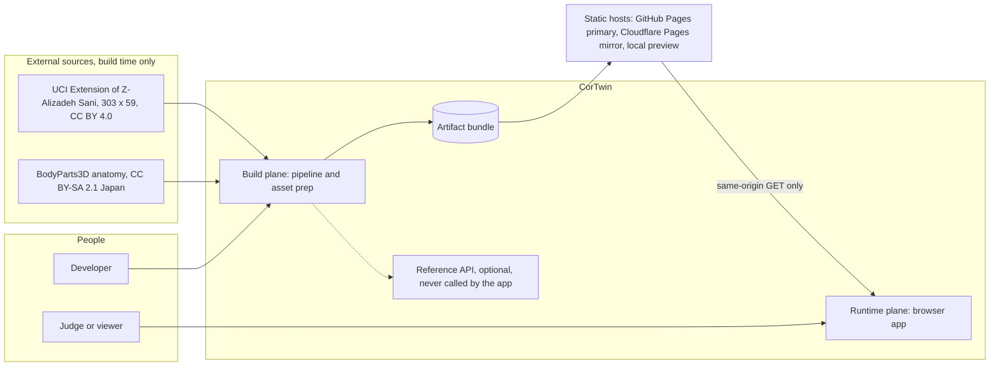

**Trust boundaries.** The browser sandbox is the only place case data exists. The only network traffic is same-origin static `GET`s. External sources are touched once, at build time, by a developer.

---

## 4. Architecture overview: three planes and one bridge

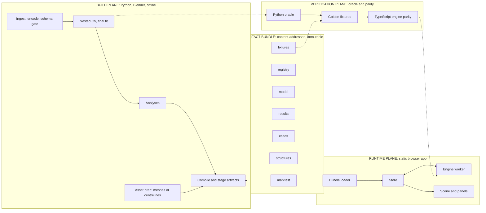

| Plane | Responsibility | Executes | Lifecycle | If it fails |
|---|---|---|---|---|
| **Build** | Turn data and meshes into trustworthy, versioned artifacts | Developer machine, optional CI | Re-run when data, config or model changes | No new artifacts; the last committed bundle keeps working |
| **Bridge** | Carry facts from build to runtime with integrity | Static files | Immutable per content hash | App refuses mismatched artifacts (INV-15) |
| **Runtime** | Evaluate, explain, render, and let the user explore | Viewer's browser | Per page load | Degrades along a defined ladder ([§16](#16-reliability-and-degradation)) |
| **Verification** | Prove runtime equals oracle; prove invariants hold | CI, developer, and in the browser | Every change; also on demand in-app | Blocks release, never blocks a viewer |

**Three kinds of fact, three owners.** The bridge carries only facts of these kinds, and each lives in exactly one artifact family:

| Kind | Meaning | Lives in | Example (descriptive) |
|---|---|---|---|
| **Defined** | Chosen by people | `registry` | Which features exist, their modality, which mesh a vessel uses |
| **Learned** | Fitted by the pipeline | `model` | Trees, coefficients, Platt parameters, thresholds, background rows |
| **Measured** | Observed by validation | `results` | Cross-validated metrics, calibration, ladder, leakage laboratory |

A UI element that needs a fact asks the artifact family that owns it. It never derives a fact that another family owns.

---

## 5. Build plane

### 5.1 Pipeline structure

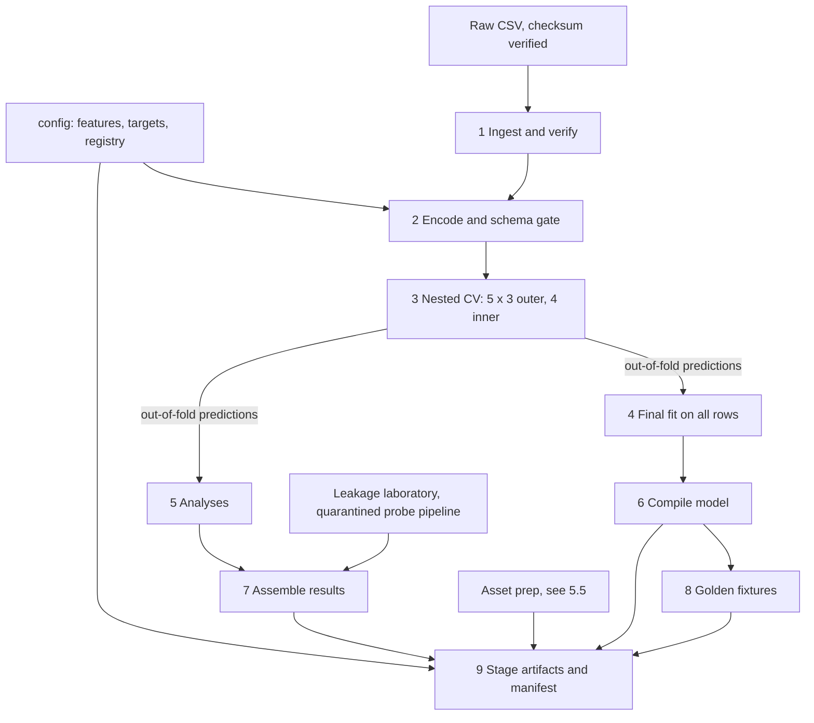

| Stage | Guarantee |
|---|---|
| 1 Ingest | Row/column counts and checksum match; fails loudly on a different file |
| 2 Encode | Strict encoders that raise on unknown categories; feature set derived from config; forbidden columns asserted absent (INV-01); BMI treated as derived, not free input |
| 3 Nested CV | Every fitted quantity — scaler, models, calibration, threshold, abstention band — is fitted inside the training fold; the outer test fold is touched only for scoring; folds are stratified on the joint vessel pattern; no resampling or synthetic oversampling anywhere |
| 4 Final fit | Models fitted on all rows; calibration, threshold and band parameters come from **out-of-fold** predictions, never from in-sample predictions |
| 5 Analyses | All evidence is derived from the same out-of-fold prediction store: metrics with intervals, calibration, threshold and abstention sweeps, subgroups, the evidence ladder, coherence statistics |
| 6 Compile | Model converted to the compact runtime form; export refuses models that violate additivity or the tree-feature bound (§8.7); a Python re-implementation of the runtime walker must reproduce the trained model before anything is written |
| 7 Results | One document of measured facts, with provenance (data checksum, seeds, code revision) |
| 8 Fixtures | Inputs plus expected outputs from the oracle, including independent SHAP from a reference library |
| 9 Stage | Artifacts written content-addressed; manifest lists names, hashes, sizes, schema version; superseded files removed |

### 5.2 Shared configuration is the single schema authority

`config/` is read by **both** the pipeline and the web app (through the registry artifact). Feature names, encodings, modality membership and target definitions are therefore defined once. The pipeline cannot train on a feature the UI does not know about, and the UI cannot render a field the model does not consume. Adding a feature starts here (see [§11](#11-registry-and-correspondence)).

### 5.3 Evidence base: out-of-fold predictions

All measured facts descend from one object: the out-of-fold prediction store from stage 3. Metrics, calibration curves, threshold sweeps, abstention curves, subgroup results and the ladder are views of it. Consequences:

- A single leak-free source supports every claim on the Trust view.
- The browser never receives patient-level out-of-fold predictions. It receives **precomputed summaries and sweeps**, which is why the UI can never recompute a metric (INV-04, ADR-13).

### 5.4 Quarantined dishonesty: the leakage laboratory

The Trust view demonstrates the cost of leakage by running deliberately flawed variants (resampling before cross-validation, feature selection before cross-validation, vessel labels as features, seed lottery). This code:

- lives in an isolated module that the production training path **MUST NOT import** (import-boundary test);
- uses a separate **probe model**, not the deployed one, and its results are labelled as such wherever shown;
- reports into `results` like any other measured fact.

This keeps flawed code from ever contaminating the real pipeline, and prevents a probe-model number from being mistaken for the deployed model's number.

### 5.5 Asset pipeline and the mesh gate

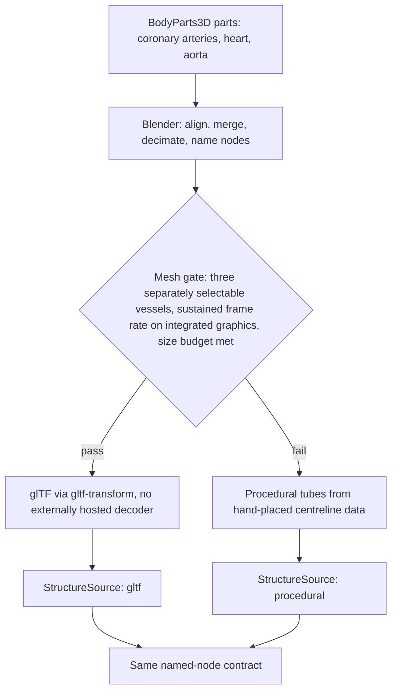

The outcome of the gate must not change any other part of the system. Both sources satisfy one **named-node contract** (`HEART`, `AORTA`, `LAD`, `LCX`, `RCA`), validated against the registry (INV-05). Mesh quality can therefore be decided late without architectural consequence (ADR-12).

### 5.6 Reproducibility and provenance

- All randomness is seeded from one declared seed set.
- Every produced artifact is content-hashed; the manifest records data checksum, seeds, code revision and tool versions.
- **Two reproduction levels:**
  - *Level 0 (every CI run):* verify that committed artifacts are internally consistent (hash chain), that fixtures pass, and that leakage and schema gates hold. No retraining.
  - *Level 1 (`make reproduce`):* full retrain and revalidation from raw data. Run on pipeline changes and before freeze; results must match the committed reference within a declared tolerance.
- The deployed model's identity is the hash of its artifact. That hash is shown in the UI's model card, so any on-screen number is traceable to a specific build.

---

## 6. The artifact bundle (the bridge)

### 6.1 Catalogue

| Artifact | Kind | Producer | Consumers | Load | Notes |
|---|---|---|---|---|---|
| `manifest` | — | Stage 9 | Loader | **Inlined into `index.html` at build** | Atomic: a deploy switches the whole bundle at once; no stale-manifest skew |
| `registry` | Defined | Config copy | Domain, store, scene, panels, Trust | Critical | Identity and schema |
| `model` | Learned | Stage 6 | Worker, domain | Critical | Trees, linear parts, scaler, Platt, thresholds, band cutoffs, reliability tiers, background rows, percentile tables. Committed to the repository as the deliverable model weights |
| `structures` | Defined | Asset prep | Scene | Critical (parallel with model) | glTF **or** centreline data, per the mesh gate |
| `cases` | — | Stage 9 | Store | Critical | Labelled example profiles (hypothetical and in-sample cohort records) |
| `results` | Measured | Stage 7 | Trust, Inspector Evidence tab, Evidence Rail | **Idle prefetch** after first paint; lazy on demand | Not needed for first interaction |
| `fixtures` | — | Stage 8 | Verification, System → Integrity | Lazy, on demand | Same files CI uses |

### 6.2 Versioning and compatibility

Three independent identities, never conflated:

| Identity | Meaning | Changes when |
|---|---|---|
| `schemaVersion` | Shape of the artifacts | A contract changes. The app supports exactly one major version |
| `modelId` | Content hash of `model` | Anything the model computes changes |
| `appVersion` | Source revision | Any code changes |

A major-version or hash mismatch blocks boot with an explanatory screen (INV-15, FM-01).

### 6.3 Delivery properties

- **Content-addressed filenames; immutable.** Static hosts with unknown cache lifetimes therefore cannot serve mixed versions.
- **One build, any host.** Relative base paths and fragment routing ([§9.6](#96-navigation-and-url)) let the identical output deploy to every target.
- **Integrity verified in the browser** before any artifact is used.
- **No runtime artifact discovery.** The app can request only what the inlined manifest lists.

---

## 7. Domain model

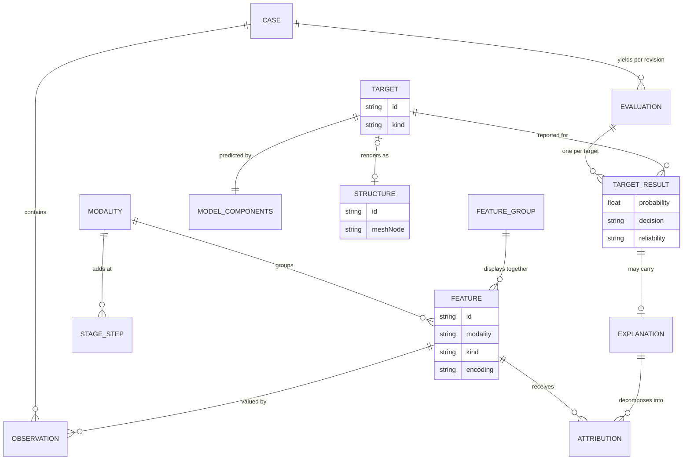

### 7.1 Core concepts

| Concept | Definition |
|---|---|
| **Case** | A named set of feature values plus a provenance label (`hypothetical`, `cohort-record`, `blank`). The label is permanent and always displayed. |
| **Observation** | A feature value and whether it is *provided*. Provision is tracked per field and per modality. |
| **Mask** | The set of observed features implied by provision flags. The only way missingness enters the engine. |
| **Revision** | A monotonic integer incremented on every change to a case. Every computed result carries the revision it answers. |
| **Evaluation** | The engine's answer for one (case values, mask) pair: per-target probability, margin, decision state, reliability tier, and the displayed CAD value with its source. |
| **Explanation** | Exact attributions for one target of one evaluation, aggregated by feature, display group and modality, with mandatory caveat keys. |
| **Reference prediction** | The prediction when nothing is observed: the model's averaged behaviour over the background set. The explanation's starting line. |
| **Decision state** | `above`, `below` or `indeterminate`, from the target's threshold and abstention band. About *this case*. |
| **Reliability tier** | `strong`, `moderate` or `limited`, from validation evidence. About *the target*. Never computed in the UI. |
| **Stage** | One cumulative step of the evidence ladder: an ordered prefix of modalities. |
| **Probe model** | A model used only to demonstrate leakage effects; never deployed. |

Decision state and reliability tier are **separate concepts with separate sources**. Neither may be derived from the other.

---

## 8. Inference and explanation core

This is the architectural centre of the product. It is a set of **pure functions** (P-2) that take the registry, the model artifact and a case, and return evaluations and explanations. It performs no I/O, touches no DOM and knows nothing about workers, React or WebGL.

### 8.1 One evaluation

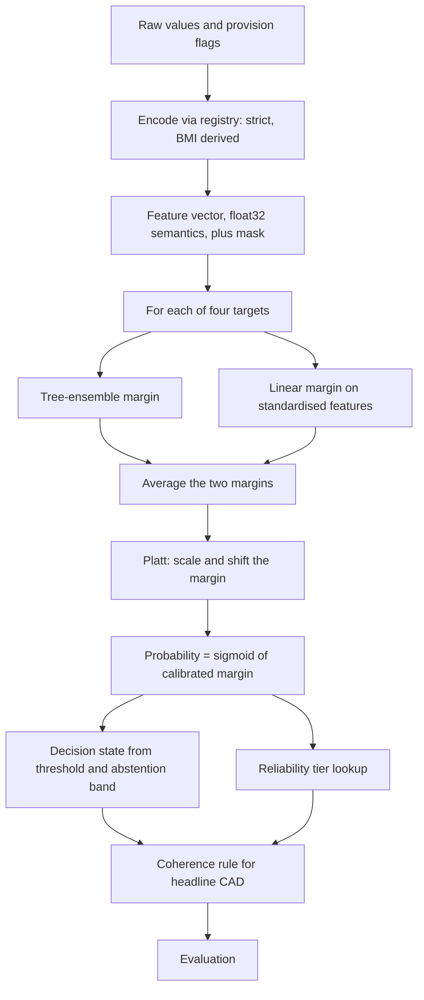

Every stage after encoding is **linear in margin space**: averaging two margins, then an affine Platt map. This is what makes exact attribution cheap (INV-02) and is the reason the model family was chosen (ADR-02).

### 8.2 Missing evidence: the value function

When some modalities are *not provided*, the engine must not pretend they are zero or typical. It defines a **value function** over subsets of observed features and uses it for both prediction and attribution, so the two cannot disagree.

```text
Let  O = set of observed features (from the mask)
     B = background set of reference rows (shipped in the model artifact)
     g(x) = calibrated margin = A * 0.5 * (tree_margin(x) + linear_margin(x)) + C

For S subset of O:
     v(S) = mean over b in B of  g( x restricted to S, b elsewhere )

Displayed probability   p     = sigmoid( v(O) )
Reference prediction    r     = sigmoid( v(empty set) )
Attribution             phi_i = Shapley value of feature i in the game (O, v), exact
Efficiency              sum(phi_i for i in O) + v(empty set) = v(O)
```

Properties that follow, and are relied on elsewhere:

- **Fully observed case:** `v(O)` equals `g(x)` exactly; the background has no influence on the prediction, only on the attribution baseline.
- **Nothing observed:** the prediction is the reference prediction. A blank profile therefore shows the model's reference behaviour, not an error.
- **Unobserved features receive no attribution** by construction (INV-14). They are surfaced in the UI as a distinct "not provided" row, never as a zero bar.
- **Averaging is in margin space, not probability space.** This is a deliberate choice: only margin-space averaging keeps the decomposition exact. It changes the meaning of "prediction with hidden modalities" slightly relative to probability-space averaging, so the evidence-ladder evidence must be generated under this same definition (R-04, §22).

### 8.3 Exact attribution

| Component | Method | Cost driver |
|---|---|---|
| Tree ensemble | Interventional SHAP by enumerating feature subsets per tree. Each tree touches a small, bounded number of distinct features, so enumeration is exact and tiny | Trees × background rows × subsets per tree |
| Linear part | Closed form per feature: coefficient ÷ scale × (value − background mean), restricted to observed features | Features |
| Ensemble | Average of the two parts, then multiplied by the Platt slope | Constant |

**Aggregation hierarchy** (all derived by summation, so levels always reconcile):

```text
feature attribution  ->  display group (e.g. "Body size" = weight + length + BMI)  ->  modality
```

- *Display groups* exist because collinear features split credit arbitrarily. The registry declares them; the engine sums them; the UI shows the group first and the members on expansion, with a standing caveat.
- The explanation payload carries its **caveat keys** (attribution is not causation; correlated features share credit; baseline-dependent). The UI is obliged to render them, so omission is impossible without a code change (INV-07 spirit).

### 8.4 Headline CAD and the coherence rule

The overall-CAD model and the three vessel models are trained independently and can contradict each other. The architecture resolves this in the **engine**, not the UI:

```text
Displayed CAD value  = max(P_CAD, P_LAD, P_LCX, P_RCA)
Displayed CAD source = the target that attains the maximum
Decision and reliability for the headline use the CAD target's own parameters
Explanation for the headline = the explanation of the source target
```

If the source is a vessel, the UI says so ("CAD shown from LAD"). The explanation therefore always explains the number that is on screen (INV-06).

### 8.5 Presentation-support computations

These are computed in the domain layer from the same inputs, so the UI never improvises them:

| Computation | Definition |
|---|---|
| **Percentile / cohort share** | Continuous features: percentile from shipped quantile tables. Binary and ordinal features: the share of the cohort with that value (a percentile is meaningless there) |
| **Ladder stages** | The same model evaluated under each cumulative modality mask. Patient-level probabilities per stage per target. Cohort-level discrimination per stage comes from `results`, never from here |
| **Deltas** | Difference between two evaluations (before/after an edit, or stage k−1 → k) per target, in probability points, with the contributing feature or modality when attributable |
| **Narrative** | Deterministic templates over the top attributions and the decision state. No generative model; no free text from outside the template set |
| **Range flags** | Per-field "outside training range" flag. Informational; never blocks input |

### 8.6 Compute scheduling

Work is classified into lanes. Within a lane only the newest revision runs.

| Lane | Work | Trigger | Priority |
|---|---|---|---|
| L0 Interactive | Evaluate all four targets | Every case change | Highest |
| L1 Explain | Explanation for the selected target | Selection change, or case change settles | High |
| L2 Ladder | Stage evaluations (no attribution) | Case change settles | Medium |
| L3 Background | Explanations for the other targets (cache warm) | Idle | Low |

Rules:

- A running job is never aborted (jobs are short); a superseded job's result is **discarded on arrival** by revision check (INV-13).
- While an explanation for the current revision is pending, the previous one stays visible, **flagged as updating**, never silently presented as current.
- Explanations are cached by `(revision, target)`; L3 results are valid until the next revision.

### 8.7 Numeric fidelity and extension bounds

- **Float semantics.** Feature values and split thresholds are rounded to single precision before comparison, mirroring the tree library; accumulation is in double precision; the model's base score is exported explicitly, never assumed.
- **Tolerance.** 1e-5 absolute for probabilities, margins and attributions (INV-03).
- **Bounded tree footprint.** Exact enumeration is only sound while each tree touches few distinct features. Export **fails** if any tree exceeds the bound. Raising it, or switching algorithm, is an architectural decision, not a configuration change.
- **Closed set of component kinds.** `tree-ensemble`, `linear`, `affine-calibration`. A new additive kind needs an attribution implementation plus fixtures. A **non-additive** model violates INV-02 and requires a new ADR.

---

## 9. Runtime plane

### 9.1 Layering and dependency rules

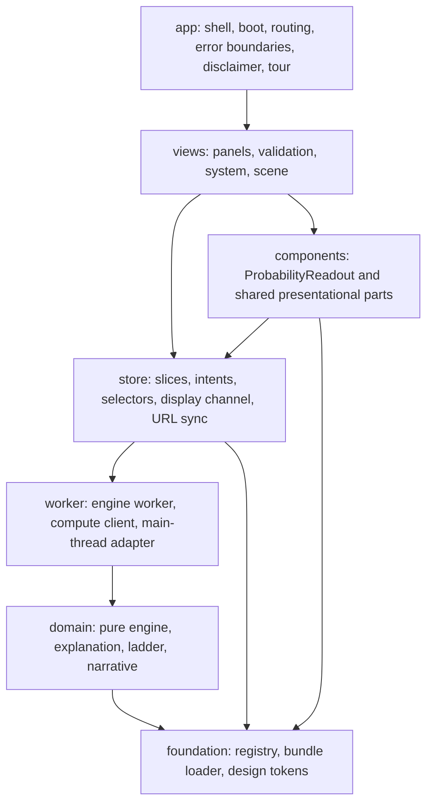

Dependencies point **downward only**. The rules below are enforced by an import-boundary check in CI.

| Module | Role | Pure? | May import | MUST NOT import |
|---|---|---|---|---|
| `domain/` | Encode, evaluate, explain, ladder, percentile, narrative | **Yes** | Registry and model *types* | React, three, zustand, worker APIs, DOM |
| `registry/` | Types, validators, typed accessors | Yes | — | `domain`, UI |
| `bundle/` | Manifest check, artifact fetch, integrity | No (I/O) | `registry` | `domain`, UI |
| `worker/` | Engine worker, compute client, main-thread adapter | No (messaging) | `domain`, `registry` types | React, three, store |
| `store/` | Slices, intents, selectors, display channel, URL sync | No (state) | `registry`, compute-client *interface* | React components, three |
| `design/` | Tokens, ramp lookup, motion constants | Yes | colour-scale library | store |
| `components/` | Shared presentational parts, `ProbabilityReadout` | Yes | `design`, store hooks | `domain`, `worker`, `scene` internals |
| `scene/` | 3D stage and 2D fallback | No | store selectors, `registry`, `design` | `domain`, `worker` |
| `panels/`, `validation/`, `system/` | Explore panels, Trust panes, System panes | No | `components`, store hooks, `registry`, `design` | `domain`, `worker`, `scene` internals |
| `app/` | Shell, boot, routing, boundaries, tour | No | everything above | — |

The key consequences: **no view can compute a clinical number** (only the worker does), **the scene cannot see the model** (only a view-model derived by the store), and **the domain core can be moved anywhere** (worker, main thread, Node, a future API) unchanged.

### 9.2 Boot sequence

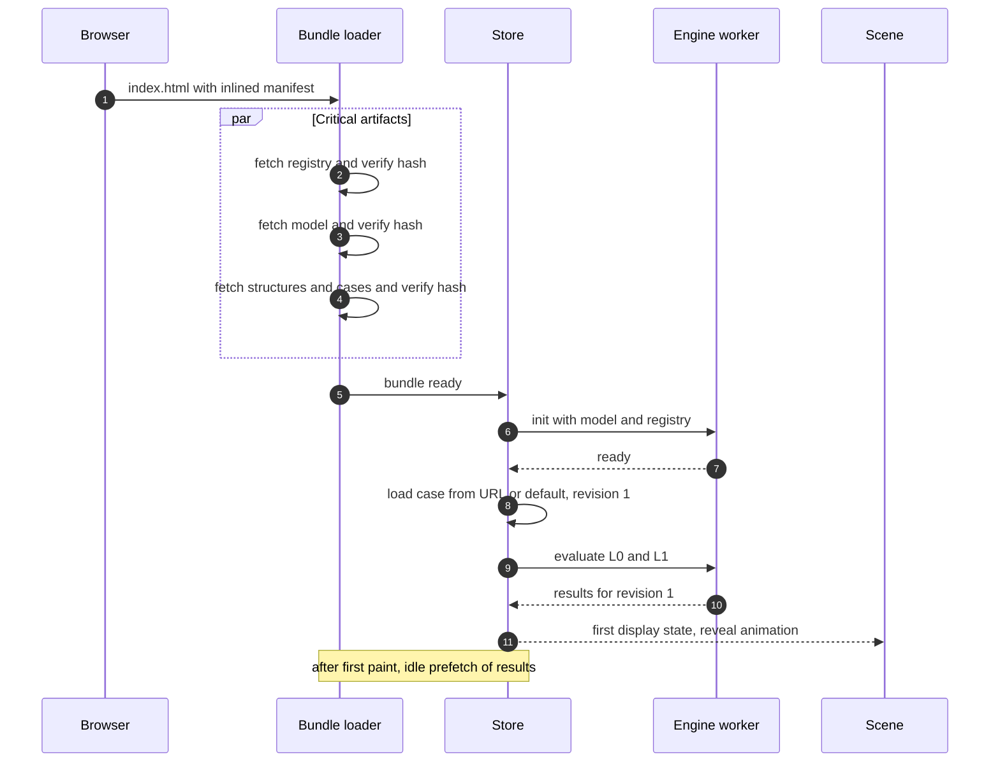

Staging rules: the first paint needs only the critical set; `results`, `fixtures`, the Trust and System code, and the tour are lazy. Structures load in parallel with the model so mesh time does not extend the critical path.

### 9.3 Compute subsystem

A **compute client** presents one asynchronous interface to the store; behind it is either the engine worker or the same engine on the main thread.

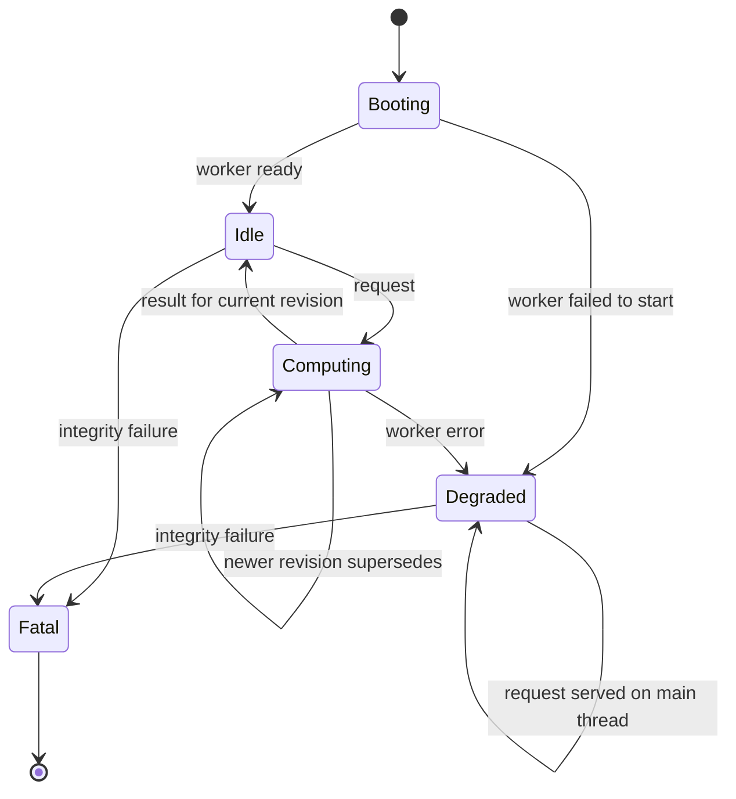

- **Degraded** means the same engine runs on the main thread. The per-evaluation cost is small enough that this is functional, only less smooth, and it is announced.
- Requests carry a revision; responses echo it. The store applies a response only if it matches the live revision (INV-13).
- The Integrity pane drives the same client with fixtures on a **verification channel** that does not touch case revisions.

### 9.4 The closed loop: input → model → anatomy → explanation

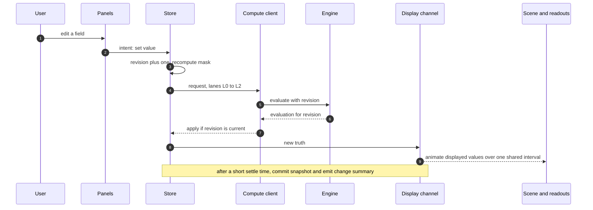

Everything the user perceives as "one system" is this loop. Three properties make it so:

1. **One entry point** — every change is an intent on the store; nothing mutates a view's private copy.
2. **One truth** — the evaluation in the store; every view derives from it.
3. **One clock** — all visual changes caused by a new truth animate over the same interval from the same driver, so the 3D colour, the number, the bars and the explanation move together (P-4).

### 9.5 State architecture

| Slice | Holds | Written by | Read by |
|---|---|---|---|
| `bundle` | Load status, manifest, registry, model metadata, results (when loaded) | Loader | Everything |
| `case` | Values, provision flags, case label, revision | Panels, case switcher, URL, tour | Compute path, panels |
| `eval` | Current evaluation (truth), last committed evaluation, stage evaluations, explanation cache, compute status | **Compute client only** | Selectors |
| `selection` | Selected vessel, modality, feature, stage; hovered entity | Scene, panels, URL, tour | Everything |
| `view` | Route, pane, drawers, camera preset, tour step, quality tier, reduced-motion | App, panels, governor | Shell, scene |

**Selected vessel is one identifier or null** and is read by the 3D highlight, the vessel card, the explanation target, the measurements table and the Trust target filter alike (INV-08). Hover is a separate single-entity channel used for linked highlighting across vessel, modality and feature.

**Truth versus displayed.**

- `eval` is the truth and changes only when a result arrives.
- A **display channel**, deliberately *outside* React rendering, holds interpolated values. The scene reads it every frame; numeric readouts subscribe to it and update directly. Animation therefore never triggers React re-renders.
- With reduced motion enabled, the interval collapses to zero; meaning is unchanged.

**Commit semantics.** A *commit* occurs a short time after the last edit settles. The evaluation before the current edit burst is retained as `committed`. Ghost ticks and change summaries ("LAD 76 → 63 because …") are differences between `committed` and the current truth. The summary describes **model response to an input change**, never a treatment effect.

**Persistence: none.** No slice is written to browser storage (INV-10).

### 9.6 Navigation and URL

- **Fragment routing** (`#/explore`, `#/trust/<pane>`, `#/system/<pane>`). Static hosts without rewrite rules would 404 on path routes, and base paths differ per host; a fragment works identically everywhere (ADR-10).
- **What the URL carries:** view, pane, case id, selected target/feature/stage. **What it does not carry:** edited field values — unless the user explicitly chooses *share*, which encodes only the differences from the named case (INV-10).
- **Direction of sync:** the URL is parsed at boot and on change; selection changes update it in place (replace), view changes add history entries.
- **Unknown identifiers** fall back to the default case with a visible notice (FM-08).
- **Code-splitting boundary:** shell, Explore and the scene are eager. Trust, System, the tour and the export sheet are lazy.
- Because state is URL-addressable, **tour steps, "Show me" links in the Requirements pane, and shared links are the same mechanism**: a declarative description of a store state.

### 9.7 Presentation rules

- **`ProbabilityReadout` is the only component that renders a probability.** It requires value, threshold, decision state and reliability tier, and renders the target-aware threshold mark, the state glyph and the tier glyph (INV-07). Compact and large variants exist; a "bare" variant does not.
- **Linked highlighting.** Hovering any representation of an entity (vessel, modality, feature) sets the hover channel; every other representation of the same entity reacts. Three entity types, one channel.
- **Redundant encoding.** State and tier are always conveyed by glyph and text as well as colour.
- **Error boundaries per region** (shell, profile, stage, inspector, rail, each Trust pane, each System pane): a fault in one region never blanks another.

### 9.8 Design tokens and the single ramp

- Tokens (colour, spacing, type scale, motion durations) are defined once and consumed by CSS and by the scene.
- **One ramp lookup** converts probability to colour. The 3D material, the legend, the charts and the vessel tags all call it, so a colour on a vessel and the same value elsewhere can never differ. The ramp is perceptually ordered with luminance rising with probability, so the highest-probability vessel is the most visible on the dark stage.
- Colour carries probability only. Identity is carried by label and position.

---

## 10. 3D scene architecture

### 10.1 Structure

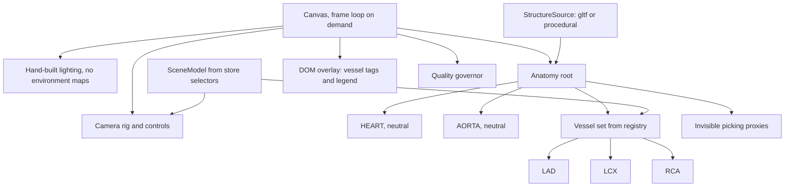

The scene is a **pure function of a `SceneModel`** (per-vessel visual state, camera target, selection, hover, quality tier) plus a `StructureSource`. It contains no clinical logic and holds no state of record.

### 10.2 Responsibilities

| Part | Responsibility | Notes |
|---|---|---|
| **StructureSource** | Supplies named nodes for `HEART`, `AORTA`, `LAD`, `LCX`, `RCA` | Two implementations behind one contract; validated against the registry at load; failure triggers fallback to the other |
| **Vessel visual state** | `{value, decision, selected, hovered, dimmed}` per vessel | Derived by a selector from the display channel; unit-testable without WebGL |
| **Material driver** | Pure map from visual state to material parameters | One shared material kind; per-vessel parameters; zero textures |
| **Decision encoding** | Above: solid saturated ramp colour. Below: same ramp, lower value. Indeterminate: **hatching** plus label | Hatching is a **world-space stripe pattern**, so it needs no UV coordinates and works on any mesh or tube. Anatomy never becomes translucent |
| **Selection encoding** | Outline or emissive boost on the selected vessel; others reduce saturation, not opacity | |
| **Picking** | Raycast against **invisible, thicker proxy tubes** around each vessel | Thin vessels are hard to hit; proxies give forgiving selection without altering the visible mesh |
| **Camera director** | Presets from the registry, eased fly-to, damped orbit with distance and angle limits | Instant under reduced motion |
| **Overlay** | Vessel tags and the target-aware legend as DOM elements positioned by projection | No in-canvas text, so no font fetched |
| **Quality governor** | See §10.4 | |

### 10.3 Render on demand

The frame loop is idle by default and produces **zero frames when nothing changes**. A frame is requested only when: a display-channel animation is running, controls are moving or damping, the hover target changes, the viewport resizes, or the quality tier changes. An attract-mode rotation is a bounded exception (reduced frame rate, auto-stops on first interaction or after a fixed time).

### 10.4 Quality governor

| Tier | Settings | Trigger |
|---|---|---|
| Q0 | Full pixel ratio (capped), anti-aliasing, full hatching | Default |
| Q1 | Lower pixel-ratio cap, no anti-aliasing | Sustained slow frames while rendering |
| Q2 | Pixel ratio 1, hatching replaced by solid with text label | Continued slow frames |
| Q3 | **2D schematic** (see below) | No WebGL, context lost and unrecoverable, or Q2 still failing |

- The governor measures only while frames are actually being produced (idle time is not slowness).
- It is **downgrade-only within a session**, with hysteresis, to avoid visible flapping; the user may force a tier.
- The 2D schematic is rendered from the **same `SceneModel` and the same registry** (each structure has a schematic path), so vessel identity, colour, tags and selection behave identically.

### 10.5 No third-party fetches from libraries

Some 3D helper libraries fetch decoders, environment maps or fonts from public CDNs by default. These defaults **MUST** be disabled or self-hosted: no environment presets, no in-canvas text, mesh compression that needs no externally hosted decoder. The request-audit test (INV-09) fails the build if any cross-origin request appears.

### 10.6 Resource budget and lifecycle

Budgets are in [§15](#15-quality-attributes-and-budgets). Structurally: shared materials and geometries; explicit disposal on unmount; texture-free scene; context-loss handlers that attempt restoration before degrading to Q3.

---

## 11. Registry and correspondence

The registry is the system's **identity authority**: it defines what exists and how the parts correspond.

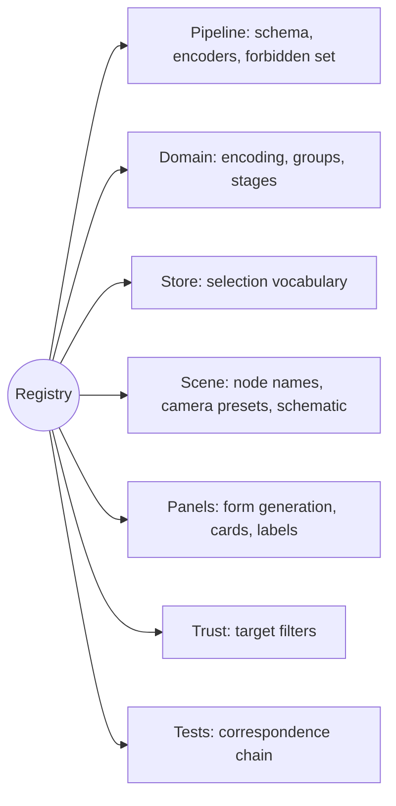

### 11.1 Content (conceptual)

| Entity | Defined here | Deliberately **not** here |
|---|---|---|
| Modalities | Order, label, membership | Their effect (learned or measured) |
| Features | Identity, label, kind, encoding, display group, derived formula, unit and range *as taken from the verified dataset dictionary* | Coefficients, importances |
| Stages | Ordered cumulative steps | Per-stage performance |
| Targets | Identity, kind (overall or vessel), model key, structure link, cohort-label definition text | Thresholds, tiers, metrics |
| Structures | Identity, mesh node name, camera preset, 2D schematic | Colours (these come from probabilities) |

### 11.2 Referential integrity at three gates

1. **Build:** every target's model key exists; every vessel target's structure exists; every feature's modality exists; the forbidden set is disjoint from the feature set.
2. **Load:** the same checks run on the shipped registry plus structure-source node validation. Failure is a visible degradation or boot block, never a silent default.
3. **Test:** the **correspondence chain** is asserted end to end — vessel → model target → probability → mesh node → vessel card → explanation → Trust filter — for every vessel in the registry.

### 11.3 Extension recipes

| Change | Edit | Regenerated | Gates that must pass | UI code changes |
|---|---|---|---|---|
| Add a clinical feature | `features` config | Retrain, all artifacts | Leakage, parity, registry | None (form is generated), unless a new control kind is needed |
| Add a control kind | Component | — | Component tests | One component |
| Add a modality / ladder stage | `modalities`, `stages` | Retrain, results | Registry, parity | None |
| Add a predicted vessel or territory | `targets`, `structures`, mesh node | Retrain, artifacts | Correspondence chain | None (cards, legend, tags, camera are generated) |
| Add a context structure | `structures` only | Structures artifact | Node contract | None |
| Swap or add a model component | Component kind, attribution, fixtures | Retrain, fixtures | Additivity, parity | None |
| Add a view or pane | Route table, lazy chunk | — | Boundary lint | The new pane |

The brief's extensibility requirement is met by this table being true, and the video can demonstrate one row.

---

## 12. Trust and System views

### 12.1 Trust

- **Read-only over `results`.** Typed accessors throw if a section is missing; panes show a retry state rather than a blank.
- **Generic chart primitives** (bars, curves, reliability diagram, histogram, grouped bars) over scale utilities. A chart receives series; it never receives raw predictions and never computes a metric (INV-04).
- **Interactive sweeps** (threshold, abstention) read **precomputed** sweep arrays. The "your current case" marker uses only the live evaluation's margin and the band cutoff.
- **Leakage panel** always labels its numbers as *probe model*, and shows the deployed model's own figure on a separate row.
- **Target selector is shared** with the Explore selection (single store).

### 12.2 System

| Pane | Architecture |
|---|---|
| **Requirements** | A declarative table mapping each requirement to a deep-link state. A test asserts every link parses to a valid state |
| **Architecture** | Static explanatory content plus manifest facts (hashes, sizes, versions) |
| **Integrity** | Loads `fixtures` lazily, runs them through the **same compute client** on the verification channel, compares with expected outputs and reports the maximum deviation per output class against the tolerance. Independent of the case store. Not a mock: it executes the production engine |
| **Model card** | Static text plus manifest, licence and attribution entries, and `results` for any number |

### 12.3 Cross-cutting features built on the same mechanisms

- **Guided tour:** a declarative list of steps, each a store state plus copy. It drives the store through the same intents as a user. No special code paths.
- **Export:** a print-styled sheet rendered from the current view-model; the browser's print-to-PDF produces the file. No PDF library, no network.
- **Input Audit and Model Card drawers:** read-only projections of registry, case and manifest.

---

## 13. Reference API (optional)

A small service wrapping the **same Python modules** the pipeline uses for prediction and explanation. It is not a reimplementation.

| Aspect | Decision |
|---|---|
| **Purpose** | (1) A real, runnable "model backend" matching the oracle for reviewers; (2) a manual cross-check; (3) local container demonstration |
| **Coupling** | **None.** The web app never calls it. Its absence or failure affects nothing (INV-09) |
| **Parity testing** | CI imports the Python modules directly; it does not go through HTTP |
| **Interface** | Mirrors the shared evaluation/explanation payload (C-08) |
| **Hosting** | Local container by default. Any hosted deployment is optional and outside the critical path |

---

## 14. Verification architecture

Verification is part of the architecture, not an afterthought: the product's central claim (INV-03) is only credible if equality with the oracle is demonstrated continuously.

### 14.1 Oracle hierarchy

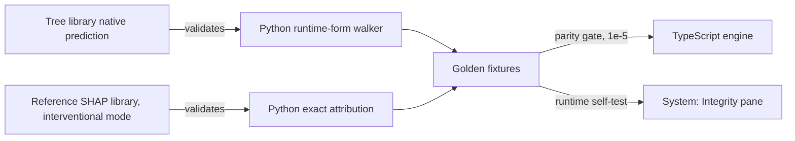

Each link is checked by an **independent** implementation: the compile step validates the runtime-form walker against the library; the attribution code is validated against a separately written reference library; the TypeScript engine is validated against fixtures generated by the validated Python. A bug would have to be reproduced identically by two independent implementations to survive.

### 14.2 Fixture design

Fixtures are chosen by *coverage of behaviour*, not at random. Target dimensions:

| Dimension | Why |
|---|---|
| Real cohort rows, fully observed | Baseline parity |
| Each modality masked singly, and each cumulative stage mask | Marginalisation and the ladder |
| Nothing observed | Reference prediction path |
| Values exactly **at** split thresholds and at float-rounding boundaries | Single-precision comparison fidelity |
| Every level of every categorical and ordinal field | Encoder completeness |
| Cases near each target's threshold and band edges | Decision-state boundaries |
| Cases where a vessel exceeds CAD | Coherence rule |
| Cases with out-of-range values | Range flags without failure |

### 14.3 Test layers

| Layer | Asserts | Runs in |
|---|---|---|
| Pipeline | Schema gate, leakage guard, strict encoders, stage determinism, hash chain, leakage-lab import quarantine | CI (Level 0) |
| Compile | Runtime-form walker equals trained model; additivity and tree-feature bound | Pipeline |
| Parity | Engine equals fixtures for probability, margin, attribution, group and modality sums, efficiency | CI, plus in-app |
| Domain units | Value function properties, coherence rule, decision state, percentile, deltas, narrative templates | CI |
| Store | Revision protocol, stale-result discard, selection single-source, commit semantics | CI |
| View-model | Vessel visual state, hatch/decision mapping, material driver | CI, no WebGL needed |
| Registry | Referential integrity and the correspondence chain | CI |
| Copy | Vocabulary lint over user-visible strings and templates | CI |
| End to end | The scripted golden path; the persistent disclaimer on every route; **request audit** (no cross-origin requests, none carrying case data); no console errors | CI against built output, and post-deploy against the live URL |
| Budgets | Bundle and artifact size ceilings | CI |
| Reproduction | Full retrain matches committed reference within tolerance | Manual (Level 1) |

### 14.4 Delivery pipeline

```mermaid
flowchart LR
  A["Lint and type check"] --> B["Import-boundary check"]
  B --> C["Pipeline tests: schema, leakage, hash chain"]
  C --> D["Domain, store, registry, copy tests"]
  D --> E["Parity against fixtures"]
  E --> F["Build once, relative base"]
  F --> G["Budget check"]
  G --> H["End-to-end and request audit"]
  H --> I["Deploy primary and mirror"]
  I --> J["Post-deploy smoke on live URLs"]
```

---

## 15. Quality attributes and budgets

All budgets are **design targets**. Each has an owner layer and a measurement method; measured values replace targets in `Implementation.md` as they are obtained. The 100 ms loop in particular has not been measured in JavaScript.

| ID | Attribute | Target | Owner | Measured by |
|---|---|---|---|---|
| B-01 | **Input → first visual change** | p95 ≤ 100 ms on a mid-range laptop | store, worker, display channel | Performance marks from intent to first display-channel update |
| B-02 | **Engine evaluate, four targets, fully observed or masked** | ≤ 15 ms | domain | Benchmark on fixtures |
| B-03 | **Explanation for the selected target** | ≤ 60 ms off-thread | domain | Benchmark on fixtures |
| B-04 | **3D frame rate during interaction** | ≥ 30 fps sustained on integrated graphics; zero frames when idle | scene | Frame-time sampling under CPU throttling |
| B-05 | **Scene cost** | Triangles ≤ 150k total; draw calls ≤ 30; zero textures | structures, scene | Scene statistics in CI or dev HUD |
| B-06 | **Critical-path transfer** (JS, registry, model) | ≤ 1.5 MB | build | Build report |
| B-07 | **Structures transfer** | ≤ 2.5 MB, loaded in parallel | asset prep | Build report |
| B-08 | **Time to first coloured heart** | ≤ 3 s on broadband | app | Performance marks |
| B-09 | **Memory** | Page ≤ 300 MB; worker ≤ 100 MB | all | Browser profiler |
| B-10 | **Accessibility** | Vessels selectable by keyboard; text contrast at AA; reduced motion honoured; probability changes announced | panels, scene | Checks and manual review |
| B-11 | **Browser support** | Current evergreen Chrome, Edge, Firefox, Safari; WebGL2 preferred, 2D fallback otherwise | scene | Manual matrix |
| B-12 | **Reproduction time** | Clean checkout → full `results` in a reasonable laptop session | pipeline | Level-1 run log |

**Update-loop budget allocation (B-01).** Coalescing to the next animation frame: ≤ 16 ms. Message transfer: small, typed arrays: ≤ 2 ms. Evaluate: ≤ 15 ms. Store apply + first display update: ≤ 16 ms. Slack for animation start: remaining. Explanation (B-03) is **off the critical visual path**: the vessel colour and probabilities move first; attribution bars follow.

**Performance mechanisms** (each exists because a budget needs it): frame-coalesced edits; lanes and discard-on-arrival; explanation cache; precomputed ladder and sweeps; code splitting; transient display channel outside React; render on demand; downgrade-only governor; texture-free scene.

---

## 16. Reliability and degradation

### 16.1 Degradation ladder

| Level | Trigger | Behaviour | User sees |
|---|---|---|---|
| G0 | Nominal | Full scene, worker engine | — |
| G1 | Slow frames | Quality tier Q1 then Q2 | Small quality note, with a manual override |
| G2 | Mesh fails gate or fails to load | Procedural structure source | Nothing, or a neutral note |
| G3 | Worker cannot start or crashes | Same engine on the main thread | Notice: "running in compatibility mode" |
| G4 | No WebGL or context lost beyond recovery | 2D schematic from the same scene model | Notice; all interactions remain |
| G5 | `results` unavailable | Explore fully works; Trust panes and cohort-AUC views show a retry state | Inline retry |
| G6 | Integrity or schema failure, or model cannot load | Boot blocked with an explanatory screen | Reason and reload action |

Every level preserves the **safety banner, vessel identity and probability context** (INV-07, INV-12). Only richness is lost, never meaning.

### 16.2 Failure modes

| ID | Failure | Detection | Response |
|---|---|---|---|
| FM-01 | Artifact hash or schema mismatch | Loader verification | Boot block (G6); no partial run |
| FM-02 | Worker fails to start or errors | Init timeout, error event | Main-thread engine (G3) |
| FM-03 | Result for a superseded revision | Revision check | Discard silently; never displayed as current |
| FM-04 | Non-finite value from the engine | Finite assertion on output | Mark the evaluation invalid; show a calculation-error state instead of numbers |
| FM-05 | Invalid input (unknown category, non-numeric) | Strict encoder throws | Field-level message; previous valid value retained; no evaluation with bad input |
| FM-06 | WebGL unavailable or context lost | Context events, capability check | Restore attempt, then G4 |
| FM-07 | Required structure node missing or mesh load error | Node-contract validation | Switch source (G2); if both fail, G4 |
| FM-08 | Unknown identifier in the URL | Parse and registry lookup | Default case, visible notice |
| FM-09 | Stale `index.html` after a deploy requests a removed hashed asset | Load error on a boot asset | Reload prompt on the boot-failure screen |
| FM-10 | `results` fetch fails | Fetch or integrity error | G5 |
| FM-11 | In-app parity self-test deviates | Integrity pane comparison | Show deviation prominently; never blocks the app |
| FM-12 | Print or clipboard unavailable | Capability check | Hide the control or explain |

### 16.3 Isolation

Error boundaries bound the blast radius of any rendering fault to a single region. The engine, the store and the shell have no dependency on any view, so a view fault cannot corrupt state or hide the disclaimer.

---

## 17. Security, privacy and clinical-safety architecture

### 17.1 Trust boundary

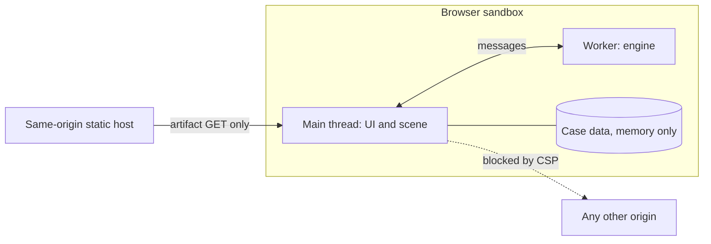

There is no server-side attack surface because there is no server-side. The security work is therefore about **keeping it that way** (INV-09, INV-10) and about **not letting library defaults reintroduce egress**.

### 17.2 Data classification

| Data | Class | Handling |
|---|---|---|
| Case input values | Treated as sensitive health data even when hypothetical | Memory only. Never stored, logged, transmitted; not in the URL unless explicitly shared |
| Evaluations and explanations | Derived from the above | Same |
| Artifacts | Public | Static, content-addressed |
| Dataset rows shipped | Public, CC BY 4.0 | Only the background set and the few labelled example records; no other patient-level data ships; both are attributed |
| Validation summaries | Public | Aggregates and sweeps only, never patient-level out-of-fold predictions |

### 17.3 Content-security intent

The exact policy is finalised during implementation and tested from the first deployment. Architectural intent:

```text
default-src 'self'
script-src  'self'
style-src-elem 'self'          style attributes permitted (positioned overlays, chart geometry)
img-src 'self' data:           font-src 'self'
connect-src 'self'             worker-src 'self' blob:
object-src 'none'              base-uri 'self'        form-action 'none'
```

Delivered as a meta policy, since the primary host cannot set headers. The policy is **defence in depth**; the request-audit end-to-end test is the real enforcement, because it also catches same-origin leakage of case data, which a policy cannot.

### 17.4 Supply chain and licensing

- Lockfiles committed; clean installs only; one audit at feature freeze; no runtime CDN, so no subresource-integrity surface.
- **Mesh assets** are derived from share-alike licensed data. They live in a separate, clearly attributed directory, and the attribution is rendered in the app from the manifest. Code and mesh licences are kept distinct. The dataset's attribution is rendered likewise.

### 17.5 Clinical-safety and claims control

Safety is enforced by structure, not by remembering to be careful:

| Control | Mechanism |
|---|---|
| Visible disclaimer | In the shell, outside every view (INV-12) |
| No decontextualised probability | One probability component (INV-07) |
| Label semantics | Each target carries its cohort-label definition from the registry; shown wherever a probability is explained |
| Provenance of cases | Case label is part of the case and always displayed; in-sample cohort records are marked as optimistic |
| Attribution caveats | Carried in the explanation payload; the UI must render them |
| Vocabulary | A lint over every user-visible string and narrative template for prohibited terms; the term list is a contract (C-13) |
| No generative output | Narrative is template-based; no runtime model produces text |
| Honest weakness | Reliability tiers are generated from validation; the UI cannot raise one |
| No intervention framing | Change summaries describe model response to input edits only |

---

## 18. Deployment and operations

### 18.1 Topology

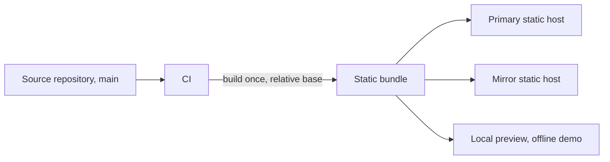

- **One build, three destinations.** Relative asset paths and fragment routing remove per-host configuration, so the identical output is deployed to the primary host, the mirror, and a local preview that works with no network.
- **Atomic releases.** The manifest is inlined in `index.html`, and all other files are content-addressed, so a deploy cannot produce a mixed-version page. A tag marks each release; rollback is redeploying a tag.
- **No runtime operations.** No servers, schedulers, secrets, environment variables or databases. Availability equals the static hosts' availability, and the mirror plus the local preview cover host failure.
- **Post-deploy verification.** The end-to-end smoke test runs against each live URL after every deploy, including the request audit.

### 18.2 Observability

There is **no telemetry**, by design. Diagnostics are local: a developer overlay (frame time, compute time, revision, tier) enabled by a flag, performance marks for the budgets, and the in-app Integrity pane. "Nothing leaves the device" is an architectural feature that can be demonstrated in the browser's network panel.

### 18.3 Environments

| Environment | Purpose | Notes |
|---|---|---|
| Development | Hot-reload app against committed artifacts | Pipeline runs separately |
| Preview | Production build served locally | Used for demos and offline recording |
| Production | Primary and mirror hosts | Same build as preview |

---

## 19. Evolution seams and non-goals

### 19.1 Designed-for envelope

| Dimension | Designed for | Strain point | Response |
|---|---|---|---|
| Features | Tens to low hundreds | Form ergonomics before compute | Search and grouping already in the UI model |
| Targets | Four; several more without redesign | Card layout, then legend | Generated UI; layout review |
| Trees | Few distinct features per tree | Above the export bound | Switch attribution algorithm (new ADR) |
| Background rows | Dozens | Explanation latency grows linearly | Reduce rows, or run L1 on settle only |
| Cases per session | One | Compare-cases feature | Evaluations are stateless per case; add a case collection to the store |
| Structures | Three predicted, two context | Mesh weight | Budgets B-05, B-07 |
| Cohorts | One | External validation set | New `results` section; no structural change |
| Model components | Three additive kinds | Non-additive model | New ADR; approximate attribution would break INV-02 |

### 19.2 Deliberate non-goals

| Not built | Reason | Re-evaluate if |
|---|---|---|
| Backend in the critical path | No requirement; adds cold starts, cost, privacy exposure | Inference must exceed in-browser capacity |
| Database, accounts, persistence | Privacy and scope | A real deployment with consent and governance |
| Generative model in the product | Hallucination risk, cost, unscored | A validated, constrained extraction use case |
| Treatment or intervention simulation | The model is observational; implies causation | Causal evidence exists |
| Telemetry | Weakens the privacy claim | Never for patient inputs |
| Offline installable app | The local preview covers offline demo | Field use |
| Multi-language UI | Out of scope | Real deployment |
| Image or report ingestion | Not in the data; adds model risk | A labelled, validated pipeline |

---

## 20. Architecture decisions

| ID | Decision | Why | Rejected | Revisit when |
|---|---|---|---|---|
| ADR-01 | Static, client-only runtime | Privacy, zero cost, no cold start, survives the judging window | Hosted inference API; serverless functions | Model outgrows the browser |
| ADR-02 | Additive ensemble (tree ensemble + linear, averaged margins, affine calibration) | Exact, cheap attribution; small artifact; calibrated | Larger non-additive ensembles (+≈0.02 AUC), approximate explanations | Explanation can be sacrificed |
| ADR-03 | Own minimal TypeScript engine | Tiny, auditable, attribution-compatible; verified against the library to ≈1e-7 in Python | Model-conversion runtimes; WASM builds of the tree library | Engine upkeep exceeds its value |
| ADR-04 | Python oracle plus golden fixtures as the parity mechanism | Two independent implementations must agree | Trusting the port; ad-hoc spot checks | — |
| ADR-05 | Marginalise unobserved evidence in **margin space** | Keeps prediction and attribution one exact game | Probability-space averaging; imputation; zero-fill | Ladder evidence disagrees (R-04) |
| ADR-06 | Artifact-mediated planes; manifest inlined; content-addressed files | Atomic, host-agnostic, tamper-evident | Runtime config fetch; version query strings | — |
| ADR-07 | Registry as identity authority; Defined / Learned / Measured separation | Prevents duplicate truth and ad hoc derivation | Per-component constants | — |
| ADR-08 | Pure domain core in a worker, with main-thread fallback | Smooth UI; identical code in every runtime | Main-thread only; server fallback | Compute grows beyond budget |
| ADR-09 | Single store plus a transient display channel outside React | One truth, one clock, no render churn | Component state; animating through React | — |
| ADR-10 | Fragment routing | Works on hosts without rewrites and under any base path | Path routing with 404 rewrites | A host with rewrite support is the only target |
| ADR-11 | Three views (Explore, Trust, System); the Evidence Rail lives inside Explore | One workspace, one scene; modalities have one control | A separate Evidence tab with its own scene | — |
| ADR-12 | StructureSource abstraction with procedural fallback | Mesh uncertainty must not threaten the project | Betting the scene on one mesh set | — |
| ADR-13 | Metrics, sweeps and curves computed offline only | Single leak-free evidence base; no patient-level predictions shipped | Computing metrics in the browser | — |
| ADR-14 | Coherence rule in the engine; headline explanation follows its source | Removes visible contradictions without UI hacks | UI-side clamping; leaving contradictions | A joint model replaces independent ones |
| ADR-15 | Leakage laboratory quarantined, probe model labelled | Dishonest code cannot contaminate the real pipeline | Mixing probe and deployed results | — |
| ADR-16 | Reference API optional, decoupled, never called | Demonstrates a real backend without a runtime dependency | App depends on API; no API at all | A hosted mode is wanted |
| ADR-17 | Zero third-party runtime requests, enforced by policy and by test | Privacy claim and offline demo | Library defaults; CDN fonts or models | — |
| ADR-18 | Deterministic template narrative | Reproducible, cannot invent clinical claims | Generative text | A validated constrained use case |
| ADR-19 | One relative-base build deployed to every host | Eliminates per-host drift | Per-host builds | — |
| ADR-20 | Downgrade-only quality governor with hysteresis | Avoids visible flapping | Continuous adaptive quality | — |

---

## 21. Traceability

### 21.1 Track A requirements → architecture

| Requirement | Satisfied by |
|---|---|
| Predict CAD and LAD, LCX, RCA | Build stages 2–6; engine §8 |
| Exclude leakage columns | INV-01; schema gate; load assertion |
| Accuracy, precision, recall, F1, ROC-AUC | Stage 5; `results`; Trust → Performance |
| Interactive 3D heart with three vessels | `scene/`; StructureSource |
| Dynamic vessel colour from predicted probability | SceneModel, ramp, display channel |
| Rotate, zoom, select | Camera rig, picking proxies, selection slice |
| Dashboard with CAD and vessel probabilities | `ProbabilityReadout`; Inspector selectors |
| Interpretable breakdown | §8.3; Explanation; waterfall |
| Measurements with relative contribution | Measurements selector: value, percentile or share, attribution |
| Open-source anatomy | Asset pipeline §5.5 |
| Persistent safety disclaimer | INV-12; shell |
| Responsive without a dedicated GPU | §10.3, §10.4, B-04, B-05 |
| Extensible architecture | §11.3 |
| Consistent vessel correspondence | INV-05; correspondence chain |
| Pipeline and model weights | Build plane; `model` artifact committed |

### 21.2 Final_demo surfaces → components

| Surface | Realised by |
|---|---|
| Case switcher and badges | `cases` artifact, `case` slice |
| Profile panel, per-field and per-modality *not provided* | Registry-generated form, `case` slice, mask |
| 3D stage, tags, legend, camera presets | `scene/`, overlay, registry presets |
| Evidence Rail and Evidence Story | `eval.stages` (patient level), `results` (cohort level) |
| Inspector depths 0, 1, 2; Why / Measurements / Evidence tabs | Selectors over `eval` and `selection` |
| Edit-to-recolour loop; change summaries | §9.4; display channel; commit semantics |
| Linked highlighting | Hover channel |
| Attract mode, reveal animation | Scene plus `view` slice |
| Guided tour, "Show me" links, share links | URL grammar; declarative states |
| Trust panes | `validation/` over `results` |
| System panes, live parity check | `system/`; compute client verification channel; `fixtures` |
| Input Audit and Model Card drawers | Projections of registry, case, manifest |
| Export | Print-styled sheet from the view-model |
| Empty, loading, error states | §16 |

---

## 22. Risks and open questions

### 22.1 Architectural risks

| ID | Risk | Mitigation built into the architecture | Residual action |
|---|---|---|---|
| R-01 | Mesh quality or merge effort | Mesh gate; StructureSource; procedural fallback | Decide at the gate |
| R-02 | TypeScript parity bugs | Oracle hierarchy; boundary-value fixtures; CI gate | Build fixtures first |
| R-03 | Attribution latency in JavaScript is unmeasured | Lanes; explanation off the visual path; cache; background-size knob | Measure early; adjust background size |
| R-04 | Evidence-ladder evidence was produced under a possibly different missing-data definition | ADR-05 defines the value function; pipeline can regenerate | **Regenerate and compare** under §8.2 before the ladder ships |
| R-05 | Some validation numbers may change when re-run on the raw data | INV-04: nothing is typed; tiers and narratives read artifacts | Re-run Level 1 early |
| R-06 | Library defaults fetch from public CDNs | ADR-17; request audit | Audit every 3D helper in use |
| R-07 | Host differences: cache lifetimes, base paths, stale index | Content addressing; fragment routing; relative base; FM-09 | Test both hosts from the first deploy |
| R-08 | Version friction among 3D libraries | Scene is isolated behind `SceneModel`; blast radius is `scene/` | Day-one smoke build |
| R-09 | Reliability-tier rule is not yet defined | Tier is generated by the pipeline with a rule id, stored in `results` | Define the rule (Q-1) |
| R-10 | Attribution restricted to observed features lacks a unit test | INV-14; masked fixtures | Test is a precondition for shipping explanations |
| R-11 | A strict content policy breaks a library (style attributes, workers) | Policy tested from the first deploy | Adjust within the stated intent |
| R-12 | Scope pressure erodes structure | Principle P-8; seams limited to those justified here | Defer non-P0 views, not boundaries |

### 22.2 Open design questions

Each is assigned to the document that should close it.

| ID | Question | Closed in |
|---|---|---|
| Q-1 | The rule that maps validation evidence to reliability tiers | `Contract.md` (rule id), `Implementation.md` (values) |
| Q-2 | Is the abstention band stored as margin distance or probability distance? | `Contract.md` |
| Q-3 | Background-set size versus attribution latency | `Implementation.md` (measure) |
| Q-4 | Mesh compression approach that needs no external decoder | `Tech_Stack.md`, `Implementation.md` |
| Q-5 | Should `results` be one file or split by view for lazy loading? | `Contract.md` |
| Q-6 | Encoding of share links (difference from a named case) | `Contract.md` |
| Q-7 | Attract-mode duration and frame cap | `Implementation.md` |
| Q-8 | Resolution of percentile tables | `Contract.md` |
| Q-9 | Where example cohort records are stored relative to the background set | `Contract.md` |

---

## 23. Contract surface index

This is the interface inventory that `Contract.md` must define. Contracts marked **freeze first** are the tightest couplings: parallel work (worker versus UI, pipeline versus runtime) depends on them.

| ID | Contract | Producer → Consumer | Notes |
|---|---|---|---|
| C-01 | Manifest | Stage 9 → Loader | Names, hashes, sizes, schema version, provenance, attributions |
| C-02 | Registry | Config → pipeline, domain, store, scene, panels, Trust | Entities in §11.1 |
| C-03 | Model bundle | Stage 6 → engine | Component kinds, thresholds, band, tiers, background, percentile tables |
| C-04 | Results | Stage 7 → Trust, Inspector, Rail | Sections: performance, calibration, sweeps, subgroups, ladder, leakage lab, protocol |
| C-05 | Cases | Stage 9 → store | Labelled example profiles |
| C-06 | Golden fixtures | Stage 8 → CI, Integrity pane | Inputs, masks, expected outputs, tolerance |
| C-07 | **Compute protocol** | Compute client ↔ engine | Requests, lanes, revision echo, errors. **Freeze first** |
| C-08 | **Evaluation and Explanation payloads** | Engine → store; Python oracle; reference API | Shared shape across three implementations. **Freeze first** |
| C-09 | Store shape, intents, selectors | Store ↔ all views | Slices per §9.5 |
| C-10 | URL grammar | App ↔ store | Fragment routes and parameters, share encoding |
| C-11 | SceneModel and StructureSource node contract | Store selectors → scene; asset prep → scene | Named nodes; visual-state fields |
| C-12 | Shared component props | `components/` ↔ views | Includes `ProbabilityReadout` |
| C-13 | Narrative templates and vocabulary rules | Domain, copy lint | Prohibited-term list |
| C-14 | Reference API endpoints | API ↔ reviewers | Mirrors C-08 |
| C-15 | Content-security policy and request allowlist | Build → browser, e2e audit | Per §17.3 |
| C-16 | Quality tiers and budget measurement protocol | Governor, CI | Per §10.4 and §15 |

---

## 24. Glossary

| Term | Meaning |
|---|---|
| **Artifact bundle** | The versioned set of files (manifest, registry, model, structures, cases, results, fixtures) that is the only coupling between build and runtime |
| **Oracle** | The reference Python implementation against which the TypeScript engine is proven |
| **Golden fixture** | An input with oracle-produced expected outputs, used for parity |
| **Margin** | Log-odds before the logistic function |
| **Platt scaling** | An affine map on the margin that calibrates probabilities |
| **Value function** | The subset-to-margin function of §8.2, shared by prediction and attribution |
| **Marginalisation** | Handling unobserved features by averaging over the background set instead of imputing |
| **Display channel** | Non-React store of interpolated values read by the scene and numeric readouts |
| **Truth versus displayed** | Computed evaluation versus its animated presentation |
| **Coherence rule** | Headline CAD is the maximum of the CAD and vessel probabilities, with the explanation following its source |
| **Content-addressed** | A filename derived from the file's hash, so a name always means the same bytes |
| **Mesh gate** | The decision point choosing glTF anatomy or procedural tubes |
| **Probe model** | A model used only to demonstrate leakage effects |