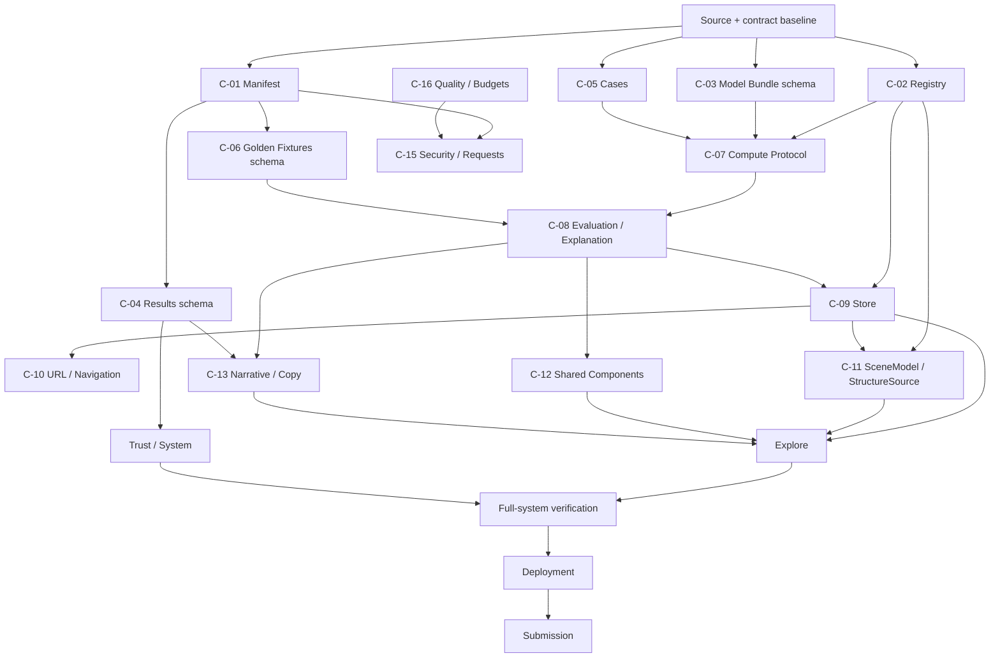
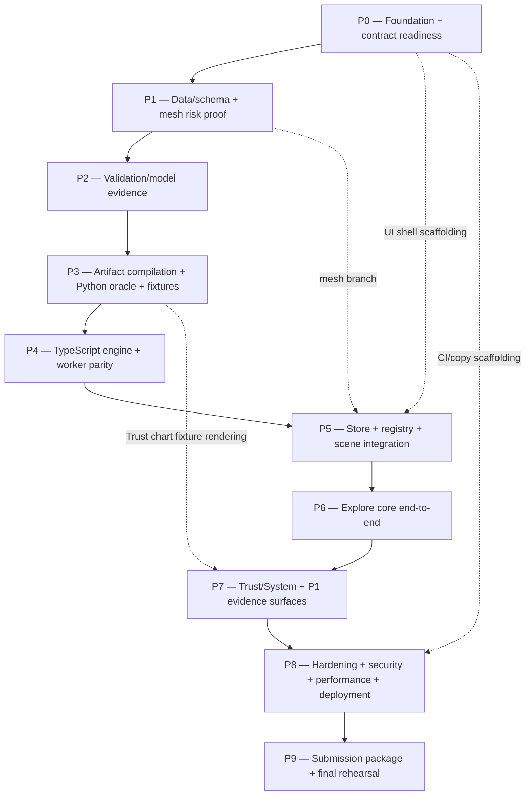

# CorTwin — Implementation Plan

**Implementation version:** 1.0  
**Planning date:** 2026-10-03  
**Execution window:** 2026-10-03 through 2026-10-14  
**Submission target:** evening of 2026-10-14 IST  
**Official deadline recorded in the supplied source set:** 2026-10-15 00:15 IST  
**Hackathon live-link requirement recorded in the supplied source set:** remain available through 2026-10-21

---

## 1. Document Purpose and Authority

`Implementation.md` is the execution strategy for CorTwin.

It does not redefine product meaning, system architecture, exact interface schemas, technology choices, or official rules. It translates those sources into a dependency-correct sequence of engineering work, verification gates, parallel-agent boundaries, integration checkpoints, release controls, and time-pressure decisions.

### Authority relationship

| Source | Owns | How this document uses it |
|---|---|---|
| Official hackathon material | Submission rules, rubric, deadlines | Hard external constraint |
| `Idea.md` | Product meaning, modelling intent, clinical framing | Preserved as product/model intent |
| `Final_demo.md` | Intended interaction and demo choreography | Converted into integration checkpoints |
| `ARCHITECTURE.md` | System structure, boundaries, invariants, architecture decisions | Treated as structural source of truth |
| `Contract.md` | Compatibility law, exact contract surfaces, verification, agent rules, release rules | Treated as normative implementation boundary |
| `Tech_Stack.md` | Technology, versions, hosting, tooling, known verification status | Used to constrain implementation choices |
| `Implementation.md` | Ordered execution, phase ownership, gates, convergence | This document |

### Source-set completeness note

The supplied files include `Contract.md`, `ARCHITECTURE.md`, `Final_demo.md`, `Tech_Stack.md`, and `Idea.md`. A standalone `Hackathon.md` was not supplied. Hackathon dates, rubric weights, submission artifacts, AI-disclosure rules, and the Discord-only open item are therefore taken only from the supplied hackathon material embedded in `Tech_Stack.md` and from the corresponding contract traceability sections. The unresolved Discord requirement remains a human decision gate; no unseen requirement is invented here.

### Carried-forward resolved conflicts

The implementation sequence MUST use the already-resolved architectural interpretations:

1. **Worker failure fallback:** Web Worker → same TypeScript engine on the main thread. The optional FastAPI service is never a browser fallback and is never on the runtime critical path.
2. **Ordinary URL semantics:** edited patient/case values do not enter ordinary navigation URLs. Explicit share links remain the only approved exception.
3. **“ML backend” wording:** the offline Python training/validation pipeline plus browser-resident inference engine satisfies the architecture unless official organiser guidance is later confirmed to require a network backend. Such a change is a human gate and contract revision, not an implementation shortcut.

---

## 2. Implementation Philosophy

CorTwin should converge by repeatedly proving a larger slice of the real system.

The governing sequence is:

```text
freeze interfaces
    ↓
prove data
    ↓
prove validation
    ↓
prove artifact compilation
    ↓
prove Python oracle
    ↓
prove TypeScript parity
    ↓
prove store/worker truth flow
    ↓
prove registry/3D correspondence
    ↓
prove Explore golden path
    ↓
prove Trust/System evidence path
    ↓
prove security + performance + degradation
    ↓
prove release + deployment
    ↓
submit
```

The plan intentionally prefers:

- stable interfaces before parallel implementation;
- small risk experiments before large subsystem builds;
- generated artifacts over hand-entered numbers;
- fixtures as integration anchors;
- early end-to-end slices over late subsystem integration;
- measured gates over subjective “looks complete” criteria;
- explicit human decisions at clinical, privacy, architecture, licence, and submission boundaries.

The objective is not maximum parallel activity. The objective is the highest probability of reaching one correct, verified, demo-ready system inside the available window.

---

## 3. Non-Negotiable Execution Invariants

Implementation work is valid only when the following remain true.

### Runtime architecture

```text
BUILD PLANE
Python validation + model compilation + asset preparation
                    ↓
             ARTIFACT BUNDLE
                    ↓
RUNTIME PLANE
React + Zustand + Web Worker + TypeScript domain engine + 3D
                    ↓
VERIFICATION PLANE
Python oracle + fixtures + parity + integrity + browser E2E
```

The browser MUST remain client-side and static.

The critical prediction path MUST NOT become:

```text
browser → backend → model server
```

### Data/model truth

- `LAD`, `LCX`, `RCA`, `Cath`, and the constant `Exertional CP` MUST remain excluded from the active model feature set.
- Unprovided evidence MUST be represented by observation masks and the contract-defined marginalisation game, never zero-fill.
- The Python implementation remains the validation/oracle reference.
- TypeScript parity is blocking.
- Exact SHAP is a correctness feature, not a presentation approximation.
- Displayed CAD must use the contract-defined source/declaration rule and MUST NOT be clamped independently in the UI.
- Numbers shown in Trust/System/documentation MUST originate from generated artifacts.
- The browser MUST NOT persist case data or transmit it externally.

### State truth

```text
domain truth
    ↓
compute result
    ↓
store
    ↓
selectors
    ↓
view-model
    ↓
presentation / animation
```

No component, scene, or animation layer may become a second source of clinical truth.

### Scene truth

The 3D scene consumes `SceneModel` and registry-backed structure metadata. It never reads model coefficients or model artifacts directly.

### Release truth

No target, metric, threshold, calibration value, attribution, or validation claim may be promoted to “verified” merely because the code exists. It must have the evidence required by its phase and the release level being claimed.

---

## 4. Project Execution Model

### 4.1 Work classes

Every implementation activity is classified as one of:

| Class | Meaning | Typical examples |
|---|---|---|
| **Serial foundation** | Must stabilize before dependent implementation | contract map, data access, schema, model representation, compute payloads |
| **Risk experiment** | Smallest proof of an uncertain high-cost assumption | mesh frame-rate gate, TS tree-walker parity spike, exact SHAP timing |
| **Parallel branch** | Independent work against frozen interfaces and isolated ownership | presentational shell, Trust chart rendering, 2D fallback, CI/copy lint |
| **Integration** | Joins independently developed outputs | store ↔ worker, registry ↔ scene, Explore choreography |
| **Gate** | Objective evidence required before downstream promotion | leakage, parity, registry, E2E, request audit, budget, deployment |
| **Human gate** | Work cannot proceed safely without an explicit human decision | clinical vocabulary, architecture change, licence ambiguity, external-service introduction |

### 4.2 Critical execution rule

A downstream task may begin before its upstream implementation is complete only when its interface is already frozen and the task can operate against fixtures, mocks, static types, or immutable artifacts without inventing new semantics.

---

## 5. Dependency Graph

### 5.1 Contract-surface dependency

The implementation follows the dependency logic established by `Contract.md`:



### 5.2 Execution dependency graph



The dashed dependencies are intentionally parallel branches. They do not bypass the required integration gates.

---

## 6. Critical Path

The critical path is dominated by correctness-producing artifacts and their downstream parity, not by UI volume.

| Workstream | Dependency | Risk | Why critical | Earliest proof | Fallback |
|---|---|---|---|---|---|
| Exact dataset acquisition | External source + checksum | High | No trustworthy model or metrics can exist without the actual data | Exact CSV obtained, dimensions/schema verified, checksum recorded | Stop predictive claims; do not substitute an unapproved dataset |
| Schema/leakage gate | Dataset | High | A leaked feature can invalidate every downstream claim | Automated schema + forbidden-column test | Block training/export |
| Nested validation | Clean schema | High | Produces the evidence artifact and deployed-model parameters | Reproduction run with protocol checks | No publication of unverified metrics |
| Runtime model representation | Validated fitted model | High | Defines what the browser must reproduce | Python runtime-form walker matches trained-library output | Block TS implementation on unstable representation |
| Golden fixture generation | Runtime-form model + oracle | High | Only authoritative bridge to TS parity | Coverage-complete fixtures | Do not use hand-picked UI examples as proof |
| TypeScript parity | Fixtures + model bundle | High | Any numerical mismatch becomes a runtime correctness defect | Full fixture parity within contract tolerance | Keep runtime unpromoted; debug before UI trust claims |
| Exact missingness + SHAP | Domain engine + background set | High | Missing modality and interpretability are core semantics | Masked fixtures, observed-only attributions, efficiency checks | Keep feature hidden until semantics pass |
| Mesh quality/performance | BodyParts3D / Blender | High | Late mesh failure can consume integration time | Three separately selectable vessels ≥30 fps on integrated hardware | Procedural tubes, then 2D schematic |
| Registry correspondence | Frozen registry + scene nodes | High | A visually correct scene can still be wrong if identity mappings drift | Full chain test vessel → target → model → node → card → Trust | Switch structure source only; never invent mapping |
| Store/revision protocol | C-07/C-08 | High | Stale computations can corrupt visible truth | Revision/stale-response tests | Disable background lanes; preserve newest-revision semantics |
| Explore end-to-end | P4 + P5 | High | The judge-facing product must work as one real path | Boot → input → inference → vessel click → explanation → edit | Reduce polish, not correctness |
| Request audit + deployment | Integrated build | High | Privacy and demo resilience depend on static/offline operation | E2E request audit and fresh-browser smoke | Use mirror/local preview; release remains blocked until audit passes |

### Critical-path principle

Any workstream in this table that is still “unverified” by its earliest proof date remains a project risk even if visual progress elsewhere is high.

---

## 7. Risk-First Strategy

High-risk work is intentionally tested before the feature that depends on it becomes expensive.

| Unknown | Cheapest useful experiment | Success evidence | Failure response | Decision owner |
|---|---|---|---|---|
| Exact training data is reachable and reproducible | Fetch the exact source and run schema/checksum gate | Exact dimensions, columns, forbidden set, checksum | Resolve source access; do not invent replacement data | Human project owner |
| BodyParts3D is usable at required performance | Import only HEART/AORTA/LAD/LCX/RCA, decimate, run three-vessel selection benchmark | ≥30 fps on integrated graphics, node identities intact | Procedural tubes | Scene/asset owner + human acceptance for final quality |
| XGBoost can be represented safely in runtime form | Export one target and compare Python runtime-form walk to trained-library probability/margin | Contract tolerance satisfied, explicit base score | Stop TS port; revise representation at the model/export boundary | Model owner |
| Exact SHAP is fast enough | Benchmark selected-target explanation against fixed background set and fixture corpus | Meets explanation target or measured deviation is explicitly gated | Optimize implementation; do not silently reduce semantics | Domain/performance owner |
| Observed-only attribution under masking | Build one masked fixture with known observed set | Unobserved IDs absent; efficiency residual passes | Block missingness UI | Domain owner |
| Worker can sustain responsive UI | Run L0/L1 workload under realistic CPU throttling | No stale commit, target budgets measured | Main-thread adapter retained; reduce concurrency, not correctness | Compute owner |
| Static hosting works without third-party requests | `npm run build` + production preview with network disabled | Boot, inference, scene, no external requests | Fix asset paths/CSP; mirror host as operational fallback | Release owner |
| Copy remains clinically safe | Run copy-lint over all visible strings/templates | Zero blocking phrases outside approved limitation context | Block release until corrected or human-gated | Clinical/copy owner |
| Documentation numbers remain aligned | Regenerate report values from `results.json` and compare referenced values | No manually diverged numbers | Regenerate docs; do not edit numbers by hand | Validation/document owner |
| Discord-only rules create a new engineering obligation | Human verifies official Discord before feature freeze | Requirement recorded as source-backed decision | Treat as open gate, not as assumed fact | Human project owner |

---

## 8. Foundation and Contract-Freeze Strategy

This phase is not “write all contracts again.” `Contract.md` is already normative.

The implementation foundation must create an operational mapping from contract law to repository ownership, tests, and build artifacts.

### Freeze order

The implementation team should establish, in this order:

1. **Artifact/schema identity surfaces:** `C-01`, `C-02`, `C-03`, `C-05`.
2. **Compute and semantic runtime surfaces:** `C-07`, then `C-08`.
3. **Verification bridge:** `C-06`.
4. **State/navigation/scene/component surfaces:** `C-09`, `C-10`, `C-11`, `C-12`.
5. **Narrative/security/quality surfaces:** `C-13`, `C-15`, `C-16`.
6. **Optional/reference surface:** `C-14`, only if P2 work is explicitly promoted.

The freeze is about interface stability, not implementation completion.

### Freeze rule

Once a downstream branch starts, changing one of the above contracts is treated as a compatibility event. Agents must not “fix” the contract locally. A material contract change triggers the human-gate/change-management procedure from `Contract.md`, fixture regeneration where applicable, and revalidation of affected consumers.

---

# 9. Phase Map

| Phase | Objective | Depends on | Produces | Verification gate | Risk |
|---|---|---|---|---|---|
| P0 | Establish repository, clean-install, contract-readiness and unknowns baseline | Source set | repo baseline, contract map, CI skeleton, risk register | G0 | Medium |
| P1 | Prove data/schema and resolve 3D asset path early | P0 | verified schema, encoding config, checksum, accepted mesh source | G1 | High |
| P2 | Build trustworthy validation/model evidence | P1 | validation outputs, leakage lab, calibration/threshold/reliability evidence | G2 | High |
| P3 | Compile immutable runtime artifacts and produce oracle fixtures | P2 | model bundle, manifest, results, Python runtime oracle, golden fixtures | G3 | High |
| P4 | Build TypeScript domain engine and worker against frozen protocol | P3 | engine, worker, parity harness | G4 | Very high |
| P5 | Build state/registry/scene integration around real outputs | P4 + P1 asset result | store, scene model, registry integration, 3D/2D source | G5/G6 | High |
| P6 | Integrate Explore into the real user path | P5 | end-to-end flagship workspace | G6 | High |
| P7 | Build Trust/System and remaining core/P1 evidence surfaces | P6 + results | validation UX, integrity, evidence rail, safety/copy surfaces | G7 | Medium-high |
| P8 | Full-system verification, performance, security, degradation and deployment | P7 | RC build, measured budgets, deployed primary/mirror | G8/G9 | High |
| P9 | Freeze, documentation, video, final smoke and submission | P8 | submission package + evidence bundle | G10 | High |

---

# 10. Detailed Phase-by-Phase Execution Plan

## Phase P0 — Foundation, Source Alignment, Repository Readiness

### Objective

Turn the existing specifications into a mechanically usable execution baseline without changing their semantics.

### Why This Phase Exists Here

Every later parallel branch depends on knowing which contracts are frozen and which uncertainties are still open. This phase also catches toolchain/repository failures before model and UI work become expensive.

### Entry Conditions

- Supplied source set is available.
- `Contract.md`, `ARCHITECTURE.md`, `Final_demo.md`, `Tech_Stack.md`, and `Idea.md` are treated as authoritative within their defined ownership.
- Development environment can be initialized.

### Scope

Repository bootstrap, clean install, contract-to-area matrix, CI skeleton, risk ledger, human-gate ledger, source-conflict carry-forward, and branch ownership.

### Sequential Execution

1. Inspect repository state and confirm the expected repository shape from `Tech_Stack.md`.
2. Verify Node 22 and Python 3.12 environments.
3. Perform clean-install smoke tests against pinned package versions and committed lockfiles.
4. Confirm the required web stack can build together: React 19.3, TypeScript 6.0.3, Vite 8.3, R3F/Three/Drei versions, Zustand, D3 utilities, and the Python stack.
5. Create/validate the CI skeleton for lint/type checks, Python tests, Vitest, build, and reproducibility commands.
6. Map each C-contract to its owning repository area and its verification contract.
7. Record all currently unresolved implementation questions:
   - exact dataset access/checksum;
   - exact BodyParts3D quality/compression configuration;
   - exact explanation background-set performance decision;
   - attract-mode maximum duration/frame cap;
   - camera orientation vocabulary review;
   - dataset units/licence verification where still unresolved;
   - Discord-only organiser requirements.
8. Record the resolved source conflicts so agents do not revive them.
9. Define branch ownership and prohibit overlapping source-of-truth edits across agents.

### Parallel Work

**Conditional.**

Once the repository/toolchain smoke is green, the following can begin independently:

- presentational UI shell only, without compute semantics;
- CI lint/type scaffolding;
- documentation skeletons and traceability tables;
- mesh acquisition experiment;
- dataset acquisition experiment.

### Inputs

- All supplied specifications.
- Pinned toolchain.
- Existing repository state.

### Outputs

- Clean-install evidence.
- CI baseline.
- Contract-to-area ownership map.
- Open-risk and human-gate register.
- Repository ownership map.
- Initial test command surface.
- Source-conflict resolution record carried into implementation.

### Contracts Consumed

`C-01` through `C-16`, `AG-01` through `AG-12`, `PH-01`, `VC-*`, `REL-DEV`.

### Contracts Frozen / Established

Operational freeze of:

- model feature ordering;
- registry ownership;
- artifact versioning assumptions;
- compute protocol boundary;
- evaluation/explanation boundary;
- store ownership;
- scene input boundary;
- copy/security/budget ownership.

### Files / Areas Touched

Expected areas:

- repository root and package/tool configuration;
- `.github/workflows/`;
- `README.md`;
- `config/`;
- `tests/`;
- documentation scaffolding.

Do not create new architectural layers to make CI easier.

### Risks

**Primary risk:** hidden toolchain conflict or unstable contract interpretation.

**Early detection:** clean install, first CI run, contract matrix review.

**Fallback:** keep implementation on the smallest pinned toolchain; do not upgrade dependencies ad hoc.

**Decision gate:** material contract interpretation conflict.

**Impact if unresolved:** all dependent work can become invalid.

### Early Proof

The repository installs cleanly, the baseline checks execute, and each implementation branch has a non-overlapping owner and explicit input/output contract.

### Verification

- clean install;
- TypeScript/type check;
- Python import smoke;
- lint;
- baseline unit test invocation;
- CI configuration validation;
- contract ownership audit.

### End-to-End Test

None beyond repository build/boot smoke; this phase proves the project can start safely.

### Definition of Done

- Clean install succeeds with lockfiles.
- Baseline CI runs.
- Contract ownership is mapped.
- No unresolved source conflict is silently interpreted.
- All open decisions are recorded with an owner.
- No agent is authorized to invent a cross-boundary schema.

### Exit Gate

**PASS:** baseline environment and ownership map valid; no blocking ambiguity.

**CONDITIONAL PASS:** only non-blocking polish or documentation gaps remain.

**BLOCKED:** environment cannot reproduce the pinned stack, a required source/contract is materially ambiguous, or a critical dependency cannot be initialized.

### Handoff

The handoff must contain the standard Phase Handoff object defined in §17, including clean-install evidence, contracts consumed, affected files, open human gates, and blockers.

### Blocks

P1 onward if the repository/toolchain cannot run.

### Can Run In Parallel With

Dataset acquisition, mesh acquisition, UI shell scaffolding, CI/copy lint scaffolding, documentation scaffolding—only after ownership is isolated.

---

## Phase P1 — Data and Schema Proof + Early 3D Risk Gate

### Objective

Eliminate the two highest-risk external inputs before model/UI integration: trustworthy data and usable anatomy.

### Why This Phase Exists Here

The model cannot be trustworthy without the exact dataset, and the 3D path can consume large amounts of time if mesh quality fails late. Both questions are cheaper to resolve before the system is built around them.

### Entry Conditions

- P0 passes.
- C-02 schema/registry shape is frozen.
- Repository and toolchain operate.

### Scope

Dataset acquisition/provenance, schema/encoding, forbidden feature exclusion, modality configuration, and BodyParts3D/procedural decision gate.

### Sequential Execution

1. Obtain the exact source dataset identified by the project documentation.
2. Record source URL/provenance and calculate the required checksum.
3. Verify expected dataset shape and schema.
4. Verify all 54 active features and all five modality groups.
5. Verify encoding rules and reject unknown categorical/ordinal levels.
6. Verify the forbidden target-related fields and constant column are excluded from the active feature set.
7. Confirm feature order is identical to configuration and downstream model order.
8. Establish field ranges from the cohort without inventing unverified external clinical units.
9. Verify the dataset/licence details needed for public reproducibility; surface any ambiguity as a human gate.
10. In a separate asset branch, retrieve BodyParts3D parts and produce a minimal scene containing HEART, AORTA, LAD, LCX, RCA.
11. Align, decimate, name, and render only the structures needed by the runtime contract.
12. Measure integrated-graphics performance and scene resource counts.
13. Decide:
    - BodyParts3D accepted;
    - BodyParts3D accepted after further optimization;
    - procedural tubes required.
14. Preserve the 2D schematic path regardless of the primary structure choice.

### Parallel Work

**YES, after schema/registry identity is stable.**

**Data branch:** dataset/schema work.  
**Asset branch:** mesh experiment using registry names but without model access.

These branches can proceed independently because the anatomy branch consumes only structure identifiers and does not need model outputs.

### Inputs

- Dataset source.
- `features.json`/equivalent configuration.
- BodyParts3D asset source and licence information.
- C-02 and C-11 structure identity definitions.

### Outputs

- Verified dataset checksum/provenance.
- Feature and modality configuration.
- Encoding validation.
- Leakage exclusion evidence.
- Range metadata.
- Accepted 3D source path: BodyParts3D or procedural fallback.
- Derived mesh source files if primary mesh is accepted.
- 2D schematic source definition.
- Asset attribution record.

### Contracts Consumed

`C-02`, `C-05`, `C-11`, `C-15`, `C-16`, `VC-01`, `VC-02`, `VC-03`, `AG-06`, `AG-07`, `PH-02`.

### Contracts Frozen / Established

- exact active feature order;
- modality membership;
- target exclusion rules;
- registry vessel IDs;
- structure node names;
- accepted structure source strategy.

### Files / Areas Touched

- `config/features.json`
- `config/registry.json`
- `data/`
- `tests/test_encode.py`
- `tests/test_leakage.py`
- `assets/`
- Blender/source asset area
- `ATTRIBUTION.md` or equivalent licence record

### Risks

**Primary risk:** exact extension CSV remains inaccessible or BodyParts3D fails quality/performance.

**Early detection:** dataset fetch/checksum and Oct 4 mesh benchmark.

**Fallback:** procedural tubes for primary 3D; 2D schematic for runtime fallback. For data, do not invent a replacement dataset; unresolved dataset access blocks model claims.

**Decision gate:** data source substitution, licence ambiguity, or acceptance of materially different anatomy.

**Impact if unresolved:** model evidence or 3D integration cannot be truthfully promoted.

### Early Proof

- Schema and leakage tests pass against the actual dataset.
- Three vessel identities render and can be selected.
- Mesh performance is measured on integrated graphics before the UI relies on the primary asset source.

### Verification

- schema gate;
- leakage gate;
- encoding gate;
- asset node correspondence check;
- triangle/draw-call measurement;
- attribution/licence check.

### End-to-End Test

```text
dataset
→ schema configuration
→ validated feature vector shape

structure source
→ registry IDs
→ selectable LAD/LCX/RCA nodes
```

No clinical prediction is expected yet.

### Definition of Done

- Exact data source and checksum are recorded.
- All 54 active features are accounted for exactly once.
- Forbidden columns are absent from the model feature configuration.
- Unknown categorical/ordinal values fail validation.
- A 3D source is selected through evidence, not preference.
- Three vessels are separately selectable under the same registry IDs.
- If primary mesh is rejected, procedural fallback is proven sufficiently for downstream scene development.

### Exit Gate

**PASS:** data/schema valid and 3D primary/fallback path is chosen with evidence.

**CONDITIONAL PASS:** licence or optional asset compression details remain open but do not block the chosen path.

**BLOCKED:** exact data cannot be verified, leakage guard fails, or no usable structure source can satisfy the architecture.

### Handoff

Downstream receives the immutable schema/configuration, asset decision, attribution records, and test evidence.

### Blocks

P2 training and P5 scene implementation.

### Can Run In Parallel With

P2 cannot begin before the data schema gate. UI shell and CI branches may continue independently.

---

## Phase P2 — Validation and Model Training

### Objective

Generate reproducible, leakage-safe validation evidence and the final deployed model parameters.

### Why This Phase Exists Here

Every downstream runtime number and trust surface depends on this evidence. The browser must never become responsible for recreating validation statistics.

### Entry Conditions

- P1 data/schema gate passes.
- Active feature order is frozen.
- Dataset checksum and provenance are recorded.

### Scope

Nested CV, model fitting, calibration, threshold selection, abstention/reliability evidence, subgroup/evidence-ladder evaluation, leakage laboratory, reproducibility.

### Sequential Execution

1. Encode the dataset exactly according to the frozen feature configuration.
2. Implement and verify the nested 5-fold × 3 repeat outer / 4-fold inner validation protocol.
3. Ensure scaling, model fitting, calibration, thresholds, and abstention parameters are learned only inside the relevant training folds.
4. Keep the outer test fold isolated until scoring.
5. Confirm no SMOTE is used.
6. Train the four target models: CAD, LAD, LCX, RCA.
7. Preserve the specified model family and fixed hyperparameters unless a human-approved change is made.
8. Calibrate the ensemble margins with Platt scaling.
9. Select operating thresholds inside the validation protocol using the contract-defined method.
10. Derive abstention bands in margin space from validated evidence.
11. Produce reliability classifications from pipeline evidence; do not let the browser infer them later.
12. Produce confidence intervals and required performance/calibration artifacts.
13. Run the leakage laboratory, keeping probe-model results separate from deployed-model results.
14. Produce cumulative Evidence Rail validation results only for the validated cumulative stages.
15. Produce subgroup evidence with sample sizes and uncertainty metadata.
16. Fit the final deployed model on all 303 rows using the contract-defined parameter provenance.
17. Verify deterministic reproduction from fixed seeds.
18. Do not place patient-level out-of-fold predictions into runtime public artifacts.

### Parallel Work

**CONDITIONAL.**

After the validation protocol itself is frozen, separate agents can work on:

- pipeline execution harness;
- results schema writer;
- visualization fixtures for Trust charts;
- leakage-lab aggregation;
- reproducibility logging.

No agent may independently change the model-selection methodology.

### Inputs

- Verified dataset.
- Feature/modality configuration.
- Model recipe.
- Validation protocol.

### Outputs

- `results.json`.
- final fitted model candidate;
- calibration parameters;
- thresholds and abstention parameters;
- reliability references;
- leakage laboratory;
- subgroup and evidence-ladder evidence;
- reproducibility record.

### Contracts Consumed

`C-03`, `C-04`, `C-05`, `C-15`, `C-16`, `VC-04`, `PH-03`, model/data sections of `Contract.md`.

### Contracts Frozen / Established

- exact deployed-target set;
- model parameter structure;
- results artifact schema;
- reliability reference structure;
- threshold/abstention evidence structure.

### Files / Areas Touched

- `pipeline/encode.py`
- `pipeline/train.py`
- `pipeline/validate.py`
- `results.json`
- model-training tests
- reproducibility logs

### Risks

**Primary risk:** leakage or fold-boundary contamination.

**Early detection:** deliberately adversarial tests, schema-based leakage assertions, validation-protocol assertions.

**Fallback:** block model generation and fix the pipeline. Never repair the result in the artifact layer.

**Decision gate:** model architecture change, validation methodology change, or interpretation of clinically material evidence.

**Impact if unresolved:** no trustworthy runtime artifact or Trust page.

### Early Proof

One target can complete a full nested-validation cycle with protocol assertions before scaling to all four targets.

### Verification

- schema;
- leakage;
- fold-isolation;
- no-SMOTE;
- calibration-inside-fold;
- threshold-inside-fold;
- abstention-inside-fold;
- reproducibility;
- results schema validation.

### End-to-End Test

```text
verified dataset
→ encoding
→ nested validation
→ final fit
→ results artifact
```

### Definition of Done

- All four targets are trained under the frozen protocol.
- `results.json` contains no prohibited patient-level data.
- Leakage guards pass.
- Validation configuration is independently checked.
- Calibration, threshold, abstention, reliability, subgroup, and Evidence Rail evidence are artifact-backed.
- Reproduction from fixed seeds succeeds within the project's stated tolerance.
- Any model-selection optimism is documented rather than hidden.

### Exit Gate

**PASS:** results and final model candidate satisfy producer contracts and protocol gates.

**CONDITIONAL PASS:** non-critical presentation aggregation remains incomplete but the numerical artifact is complete and immutable.

**BLOCKED:** leakage, fold isolation, reproducibility, or required result generation fails.

### Handoff

Downstream receives validated `results`, the final model fit, parameter provenance, and no direct authority to alter them.

### Blocks

P3.

### Can Run In Parallel With

Trust chart rendering against fixtures may begin after the results schema is frozen, but not before numerical artifacts exist for final integration.

---

## Phase P3 — Model Compilation, Manifest, Python Oracle, and Golden Fixtures

### Objective

Create the immutable runtime bridge and the authoritative Python oracle/fixture corpus that will govern browser parity.

### Why This Phase Exists Here

The TS runtime should never implement an interpretation of a model that has not first been represented and proven in the oracle. This phase converts the trained model into the exact representation required by the browser and freezes the data used to prove parity.

### Entry Conditions

- P2 passes.
- Model bundle schema is frozen.
- Results artifact is valid.

### Scope

Runtime-form serialization, manifest, hashes, compatibility metadata, Python runtime-form evaluation, exact SHAP oracle, golden fixture generation.

### Sequential Execution

1. Export each target into the contract-defined runtime representation.
2. Make base score explicit.
3. Preserve exact feature ordering.
4. Export tree and linear components, scaling, Platt parameters, thresholds, abstention parameters, reliability references, background rows, and percentile tables.
5. Validate additivity in calibrated log-odds space.
6. Verify tree footprint and browser-size targets.
7. Build the manifest with content hashes, data checksum, seed information, source/tool versions, and artifact relationships.
8. Validate the manifest against every generated artifact.
9. Implement the Python runtime-form walker for the exported representation.
10. Compare the runtime-form Python result against the training-library result on representative fixtures.
11. Build exact Python SHAP over the frozen background set.
12. Validate SHAP against the reference implementation.
13. Validate the missing-evidence value function and observed-only attribution semantics.
14. Generate the golden fixture corpus with the required coverage:
    - fully observed;
    - blank case;
    - independent modality masks;
    - cumulative masks;
    - multiple modality combinations;
    - category/ordinal boundaries;
    - tree split thresholds;
    - float-rounding boundaries;
    - decision thresholds;
    - abstention edges;
    - headline coherence;
    - out-of-range;
    - observed-only attribution;
    - selection changes;
    - finite-output failures.
15. Attach fixture provenance: model ID, registry version, data checksum, oracle revision, seed, schema version.
16. Ensure model-dependent fixtures are invalidated whenever model content changes.

### Parallel Work

**YES after the model bundle schema is frozen.**

Possible parallel branches:

- manifest validator;
- fixture corpus generator;
- Python oracle test harness;
- artifact size reporter.

They may not independently change serialization semantics.

### Inputs

- Final fitted model.
- `results.json`.
- Registry/config.
- Data checksum and seeds.

### Outputs

- `model.json`.
- manifest.
- Python runtime-form oracle.
- exact Python attribution oracle.
- complete golden fixtures.
- artifact hashes and compatibility evidence.

### Contracts Consumed

`C-01`, `C-03`, `C-04`, `C-05`, `C-06`, `VC-05`, `VC-06`, `PH-04`, `PH-05`.

### Contracts Frozen / Established

- Model-content identity.
- Artifact compatibility metadata.
- Fixture tolerance and coverage.
- Runtime-form numerical semantics.

### Files / Areas Touched

- `pipeline/export_model.py`
- `pipeline/shap_exact.py`
- `web/public/model.json`
- `web/public/results.json`
- fixture area under `tests/`
- manifest location
- generated artifact validation tooling

### Risks

**Primary risk:** silent divergence between trained-library semantics and runtime-form semantics.

**Early detection:** Python runtime-form comparison before any TypeScript work.

**Fallback:** revise export/runtime representation at the producer boundary; do not patch the TypeScript consumer to accommodate a malformed artifact.

**Decision gate:** changing tolerance, background-set semantics, or model representation.

**Impact if unresolved:** P4 cannot start safely.

### Early Proof

Python training-library output and Python runtime-form output match before TS implementation begins.

### Verification

- artifact schema;
- hash integrity;
- additivity;
- tree footprint;
- explicit base score;
- runtime-form equality;
- exact SHAP/reference equality;
- fixture coverage and provenance;
- efficiency residual checks.

### End-to-End Test

```text
validated trained model
→ runtime-form model artifact
→ Python runtime walker
→ exact Python explanation
→ golden fixture
```

### Definition of Done

- All generated artifacts validate against the manifest.
- Runtime-form Python equals training-library results.
- Exact SHAP is validated.
- Missingness and observed-only attribution fixtures pass.
- All required fixture classes exist.
- Model ID is content-derived.
- Any changed model content automatically implies a fixture regeneration requirement.

### Exit Gate

**PASS:** artifact and oracle are authoritative and fixture-complete.

**CONDITIONAL PASS:** only non-blocking documentation formatting remains.

**BLOCKED:** training/runtime mismatch, missing fixture coverage, invalid artifact hashes, or explanation semantics not proven.

### Handoff

P4 receives immutable `model.json`, manifest, results, fixture corpus, and oracle evidence.

### Blocks

P4.

### Can Run In Parallel With

UI presentation scaffolding, Trust chart shells, CI additions, and scene asset preparation.

---

## Phase P4 — TypeScript Domain Engine and Web Worker

### Objective

Reproduce the validated model and explanation semantics in TypeScript and prove parity before UI trust depends on them.

### Why This Phase Exists Here

This is the highest-risk software port. Everything after this phase is presentation and orchestration around a numerical core. The safest integration point is therefore parity, not the first visible prediction.

### Entry Conditions

- P3 passes.
- C-07 compute protocol is frozen.
- C-08 semantic payloads are frozen.
- Model artifact and fixtures are immutable for the phase.

### Scope

Pure domain engine, tree/logistic/Platt evaluation, missingness value function, exact SHAP, worker protocol, revision handling, main-thread adapter.

### Sequential Execution

1. Implement the domain engine as a pure module with no React, Zustand, DOM, network, storage, or worker dependencies.
2. Load and validate artifact compatibility through the designated boundary.
3. Implement the tree walker with explicit float handling and the exported base score semantics.
4. Implement the linear model evaluation exactly as defined by the artifact.
5. Combine model components and apply Platt calibration.
6. Implement target decision states using threshold and abstention margin semantics.
7. Implement target reliability lookup from artifact references; never derive it from live metrics.
8. Implement the CAD headline source/coherence rule in the domain layer.
9. Implement the missing-evidence value function using the observed mask and frozen background.
10. Implement exact SHAP and the aggregation chain:
    - feature;
    - display group;
    - modality.
11. Ensure unobserved features receive no attribution.
12. Implement range flags from the input/range contract.
13. Build the worker boundary exactly around C-07.
14. Implement lane priority and request supersession.
15. Implement revision echo and stale-result rejection.
16. Implement the main-thread adapter using the exact same domain engine.
17. Keep timing metadata diagnostic and local only.
18. Generate parity evidence from the golden fixture corpus.
19. Benchmark evaluation and explanation latency.

### Parallel Work

**NO for the semantic engine.**

**YES for isolated harness work after C-07/C-08 freeze:**

- fixture runner;
- parity report generator;
- worker watchdog harness;
- performance harness.

No separate “alternative” domain implementation is allowed.

### Inputs

- `model.json`;
- manifest;
- golden fixtures;
- registry/types;
- C-07/C-08;
- frozen background set.

### Outputs

- pure TypeScript domain engine;
- Web Worker implementation;
- main-thread compatibility adapter;
- parity report;
- performance benchmark evidence.

### Contracts Consumed

`C-03`, `C-06`, `C-07`, `C-08`, `C-11` types, `VC-05`, `VC-06`, `PH-06`.

### Contracts Frozen / Established

- runtime compute implementation against C-07;
- evaluation/explanation outputs against C-08.

### Files / Areas Touched

- `web/src/worker/`
- domain/engine area
- compute-client area if separated by architecture
- parity tests and Vitest fixtures
- worker tests

### Risks

**Primary risk:** numerical or explanation drift caused by JS/TypeScript semantics.

**Early detection:** parity corpus before UI consumption.

**Fallback:** debug the shared engine/export boundary; do not loosen tolerance or special-case UI fixtures.

**Decision gate:** parity tolerance change, background-set reduction, or semantic deviation.

**Impact if unresolved:** all runtime correctness claims are blocked.

### Early Proof

At least one complete model target passes probability, margin, feature attribution, modality attribution, and efficiency checks in TS before scaling to all targets.

### Verification

- full golden fixture parity;
- probability/margin tolerance;
- feature attribution tolerance;
- display-group and modality reconciliation;
- efficiency residual;
- missingness;
- threshold/abstention edges;
- stale response handling;
- malformed request/error handling;
- worker/main-thread equivalence.

### End-to-End Test

```text
fixture input
→ worker request
→ domain engine
→ evaluation/explanation response
→ parity comparison
```

### Definition of Done

- All golden fixtures pass in TypeScript.
- Python and TypeScript are within all contract tolerances.
- Stale responses cannot commit.
- Missingness and observed-only attribution pass.
- Worker and main-thread paths use the same engine semantics.
- Performance measurements are recorded and labelled as measured, not target.

### Exit Gate

**PASS:** full parity and compute protocol checks pass.

**CONDITIONAL PASS:** performance is slightly below an architectural target but the deviation is measured, has a documented mitigation, and does not compromise correctness or release safety.

**BLOCKED:** any parity failure, stale-result violation, invalid output, or semantic mismatch.

### Handoff

P5 receives the real compute client/worker and immutable output types; no UI agent is allowed to invent a substitute payload.

### Blocks

P5/P6.

### Can Run In Parallel With

Only non-semantic presentation scaffolding and documentation/testing harnesses.

---

## Phase P5 — Store, Registry, SceneModel, and 3D Runtime Integration

### Objective

Connect real compute truth to one store and one registry, then map that truth into the 3D/2D scene.

### Why This Phase Exists Here

The scene and dashboard must not drift. Registry and store integration are the two structural bridges that make the flagship interaction coherent.

### Entry Conditions

- P4 passes.
- P1 has selected the structure source.
- Registry identity is frozen.
- C-09/C-11 semantics are frozen.

### Scope

Store ownership, intents, revisions, selection, URL state, SceneModel, structure loading, vessel presentation, 2D fallback, quality tiers.

### Sequential Execution

1. Implement the store slices with the ownership defined by `C-09`.
2. Implement canonical intents for case edits, modality provision, selection, view navigation, camera, quality, and reduced motion.
3. Implement revision increments only for case/provision changes.
4. Implement compute request orchestration using C-07.
5. Implement stale-result rejection and commit semantics.
6. Implement the display channel as presentation-only state.
7. Implement registry-backed mapping:
    - vessel ID;
    - target ID;
    - model result;
    - scene node;
    - card;
    - explanation;
    - Trust selector.
8. Implement URL synchronization through C-10, excluding edited values from ordinary URLs.
9. Build `SceneModel` from selectors rather than model data access.
10. Integrate the selected structure source.
11. Implement target-aware probability coloring, threshold legend, decision glyph/hatch and selection accent.
12. Implement picking using registry identity and safe proxy geometry if needed.
13. Implement camera presets and reduced-motion behaviour.
14. Implement Q0–Q3 quality degradation with downgrade-only/hysteresis semantics.
15. Implement 2D schematic from the same registry/SceneModel.
16. Measure scene triangles, draw calls, structure size and render responsiveness.

### Parallel Work

**YES once C-09 and C-11 are frozen.**

Safe branches:

- store implementation;
- registry integrity tests;
- scene view-model tests without WebGL;
- 3D asset loader;
- 2D schematic;
- URL parser tests.

Integration is serialized at the SceneModel/store boundary.

### Inputs

- real worker/engine;
- registry;
- accepted mesh or procedural source;
- design tokens/ramp;
- C-09/C-10/C-11/C-16.

### Outputs

- working store;
- compute client integration;
- registry correspondence implementation;
- SceneModel;
- structure source;
- 3D + 2D fallback;
- quality governor;
- URL synchronization.

### Contracts Consumed

`C-02`, `C-07`, `C-08`, `C-09`, `C-10`, `C-11`, `C-12`, `C-16`, `VC-08`, `VC-09`, `VC-10`.

### Contracts Frozen / Established

No new clinical semantics are established. Implementation establishes the executable mappings required by existing contracts.

### Files / Areas Touched

- `web/src/store.ts`
- `web/src/registry/`
- `web/src/scene/`
- `web/src/worker/` compute client integration
- router/navigation area
- scene assets under `web/public/models/`

### Risks

**Primary risk:** duplicated source of truth between store, scene, and component state.

**Early detection:** registry/store tests before visual polish.

**Fallback:** remove local state and route all truth through store/selectors; switch primary structure source without changing IDs.

**Decision gate:** any proposal to let scene read model artifacts or components calculate clinical values.

**Impact if unresolved:** integration invalid.

### Early Proof

```text
real evaluation
→ store
→ SceneModel
→ LAD/LCX/RCA scene state
```

with a single selection changing every representation.

### Verification

- store revision tests;
- stale-response tests;
- registry correspondence test;
- view-model tests without WebGL;
- scene resource budgets;
- keyboard selection;
- 2D fallback correspondence;
- reduced-motion behaviour.

### End-to-End Test

```text
real case edit
→ worker compute
→ current evaluation
→ store
→ SceneModel
→ correct vessel colour/selection
```

### Definition of Done

- One store owns application truth.
- One registry owns vessel identity.
- Scene never reads model artifact directly.
- Selection is synchronized across scene, cards, Inspector, Rail, Trust.
- Q3 2D mode preserves identity and probability semantics.
- Quality/budget measurements are recorded.

### Exit Gate

**PASS:** state and scene correspondence are proven.

**CONDITIONAL PASS:** visual polish is incomplete but all identity, truth and fallback semantics work.

**BLOCKED:** duplicated state, incorrect registry correspondence, stale result commit, or scene/model coupling violation.

### Handoff

P6 receives an actual runnable system slice capable of real input → compute → store → 3D propagation.

### Blocks

P6.

### Can Run In Parallel With

Trust data visualization shells and static documentation after their inputs are frozen.

---

## Phase P6 — Explore Core and Flagship End-to-End Experience

### Objective

Build the actual flagship workspace around real system truth and demonstrate the core journey before optional polish.

### Why This Phase Exists Here

The Explore workflow is the product’s primary integration surface and the main judge-facing path. It must become real before time is spent on secondary features.

### Entry Conditions

- P5 passes.
- Real inference works.
- Scene correspondence works.
- Store and selection semantics are stable.

### Scope

Profile, Stage, Inspector, safety banner, live edit choreography, probability rendering, primary explanation views, Measurements, accessibility, initial reveal.

### Sequential Execution

1. Build the persistent shell and safety banner.
2. Implement deterministic default-case boot.
3. Implement critical artifact load/integrity verification and first truth.
4. Implement the reveal choreography without coupling animation timing to model truth.
5. Implement the Profile accordions with configuration-driven field controls.
6. Implement per-modality “Not provided” toggles using canonical masking.
7. Implement field contributions from the current explanation output.
8. Implement the Stage with real registry-driven vessel states.
9. Implement hover/click/keyboard vessel selection.
10. Implement the Inspector at Case and Vessel depths.
11. Implement `ProbabilityReadout` as the only probability renderer.
12. Implement Why/Measurements/Evidence views from C-08 outputs and generated artifacts.
13. Implement feature editing from a SHAP/measurement row using the same store intent path as Profile editing.
14. Verify the live choreography:
    ```text
    edit
    → revision
    → worker request
    → new evaluation
    → store
    → probability/bar/SHAP/scene update
    ```
15. Implement accessibility announcements and reduced-motion behaviour.
16. Implement out-of-range warnings without inventing external clinical limits.
17. Ensure patient numbers are never typed into component source.
18. Measure input-to-first-display and first-coloured-heart timing.

### Parallel Work

**YES, narrowly.**

After P5 contracts are stable:

- Profile panel implementation;
- Inspector presentation;
- Stage presentation;
- accessibility harness;
- responsive layout projections.

They must all consume the same store selectors and `ProbabilityReadout`.

### Inputs

- store;
- real engine/worker;
- SceneModel;
- results/model artifacts;
- copy contract.

### Outputs

- functioning Explore route;
- flagship interaction path;
- accessibility-compliant input/display flow;
- first integrated demo slice.

### Contracts Consumed

`C-07`, `C-08`, `C-09`, `C-10`, `C-11`, `C-12`, `C-13`, `C-15`, `C-16`, `PH-09`, `VC-07`, `VC-10`, `VC-11`, Demo Integrity Contract.

### Contracts Frozen / Established

No semantic contract changes. The implementation establishes the integrated presentation path.

### Files / Areas Touched

- `web/src/panels/`
- Explore route/shell
- ProbabilityReadout
- accessibility helpers
- styling/layout areas
- E2E tests

### Risks

**Primary risk:** UI appears complete while hiding mocked or duplicate state.

**Early detection:** golden-path E2E must inspect real result changes.

**Fallback:** cut polish, animations, or secondary interactions; preserve real data flow.

**Decision gate:** any request to hardcode demo values or bypass the worker/engine.

**Impact if unresolved:** demo integrity fails.

### Early Proof

The judge-critical chain works without simulated UI state:

```text
preloaded case
→ prediction
→ 3D vessel click
→ explanation
→ field edit
→ updated prediction
→ updated 3D
```

### Verification

- component tests;
- store/worker integration;
- probability renderer contract tests;
- accessibility checks;
- E2E default boot;
- edit/update choreography;
- persistent disclaimer;
- request audit for the integrated route.

### End-to-End Test

Minimum golden path:

```text
boot
→ default case
→ real L0 evaluation
→ click LAD
→ L1 explanation
→ edit top contributor
→ new revision
→ new L0 result
→ updated explanation
→ updated LAD scene
```

### Definition of Done

- Real inference drives Explore.
- No mock result/state exists in the risk path.
- Vessel selection synchronizes across scene and Inspector.
- Field edits trigger real computation with revision handling.
- Probability values are always contextually framed.
- Safety banner remains visible.
- Accessibility contract is met.

### Exit Gate

**PASS:** Explore golden path is fully real and repeatable.

**CONDITIONAL PASS:** optional animation/polish remains, but core behaviour is verified.

**BLOCKED:** mocked risk-path state, stale result display, probability renderer violations, or safety/copy violations.

### Handoff

This is the first formal demo checkpoint. The build must be capable of a real judge-facing walkthrough before P7 begins.

### Blocks

P7 and the first serious demo rehearsal.

### Can Run In Parallel With

Documentation skeleton, Trust presentation work, and optional chart rendering that consumes frozen artifacts.

---

## Phase P7 — Trust, System, Evidence Rail, and P1 Surfaces

### Objective

Turn validation, explanation evidence, architecture, and missingness into transparent judge-facing surfaces without creating new computation.

### Why This Phase Exists Here

These views depend on real artifacts and real runtime output. Building them earlier risks inventing numbers or semantics.

### Entry Conditions

- P6 Explore golden path passes.
- `results.json` is immutable for the release candidate unless model regeneration is explicitly triggered.
- Copy and narrative vocabulary are frozen.

### Scope

Evidence Rail, reliability/abstention display, Validation/Trust, Leakage Audit, Input Audit, System Requirements/Architecture/Integrity/Model Card, deep-link navigation where allowed, approved drawers, and narrative templates.

### Sequential Execution

1. Implement Evidence Rail against the same modality masking semantics already used by Profile.
2. Implement cumulative stage semantics only for validated stages.
3. Implement custom-subset warning and suppress unvalidated cohort AUC claims.
4. Implement live stage evaluation using the same domain engine.
5. Implement Trust Performance from `results.json`.
6. Implement Calibration from artifact values.
7. Implement Decisions using precomputed threshold sweeps and the live case’s position relative to the validated threshold/abstention band.
8. Implement Subgroups with sample sizes and uncertainty language.
9. Implement Leakage Audit with probe/deployed labels kept distinct.
10. Implement Input Audit from schema/config/range artifacts.
11. Implement System Requirements “Show me” routes without creating unsafe URL state.
12. Implement System Architecture mapping from actual files/tests rather than a hand-built narrative.
13. Implement System Integrity’s real browser parity check against golden fixtures.
14. Implement Model Card projections from model/provenance artifacts.
15. Implement deterministic narrative templates with approved vocabulary and caveats.
16. Run copy-lint over all user-visible strings.
17. Verify Trust and System never recompute or manually type validation figures.
18. Ensure the persistent disclaimer remains outside view-local ownership.

### Parallel Work

**YES.**

Safe branches include:

- Trust chart components;
- System view;
- Evidence Rail presentation;
- copy lint;
- Model Card/documentation;
- Integrity UI.

They can proceed in parallel because they consume frozen artifacts and shared domain payloads.

### Inputs

- `results.json`;
- real engine;
- registry;
- store;
- copy contract;
- golden fixtures.

### Outputs

- Trust view;
- System view;
- Evidence Rail;
- Input Audit;
- integrity execution surface;
- deterministic narratives and caveats.

### Contracts Consumed

`C-04`, `C-06`, `C-08`, `C-09`, `C-10`, `C-12`, `C-13`, `C-15`, `VC-07` through `VC-12`.

### Contracts Frozen / Established

No new clinical semantics. The phase consumes precomputed evidence and approved vocabulary.

### Files / Areas Touched

- `web/src/validation/`
- Trust/System panels
- Evidence Rail
- narrative templates
- model card projections
- copy-lint configuration/tests

### Risks

**Primary risk:** Trust becomes a second computational pipeline.

**Early detection:** artifact-origin assertions and literal scans.

**Fallback:** remove local calculations and render directly from artifact selectors.

**Decision gate:** any new validation metric, interpretation, or clinical wording not supported by current sources.

**Impact if unresolved:** trust claims and release evidence become non-authoritative.

### Early Proof

System Integrity runs the actual JS fixture path. Leakage Audit distinguishes probe-model evidence from deployed-model results.

### Verification

- Trust artifact integrity;
- copy lint;
- System Integrity real fixture execution;
- Evidence Rail stage masks;
- custom subset warning;
- persistent disclaimer;
- view-model tests;
- deep-link safety tests.

### End-to-End Test

```text
Explore case
→ selected vessel
→ Evidence Rail stage
→ real masked evaluation
→ updated explanation
→ Trust target change
→ System Integrity
```

### Definition of Done

- All Trust numbers originate from `results`.
- Evidence Rail reuses the same missingness engine and does not simulate probabilities.
- Integrity executes the real TS parity path.
- Leakage data remain clearly separated by source type.
- System “Show me” links never expose patient values in ordinary URLs.
- All visible language passes clinical copy lint.

### Exit Gate

**PASS:** Trust/System and required P1 surfaces are backed by real artifacts/engine paths.

**CONDITIONAL PASS:** selected P1 presentation polish remains, but all required evidence semantics work.

**BLOCKED:** manually typed validation metrics, fake integrity result, unvalidated cohort claim, or unsafe wording.

### Handoff

The system is now eligible for full-system hardening and release-candidate testing.

### Blocks

P8.

### Can Run In Parallel With

Release-document drafting and final video script preparation using only verified artifact values.

---

## Phase P8 — Full-System Verification, Security, Performance, Degradation, and Deployment

### Objective

Convert the integrated build into a release candidate that satisfies correctness, safety, privacy, performance, resilience, and deployment constraints.

### Why This Phase Exists Here

The architecture requires verification to escalate from local correctness to the built production system. This phase deliberately tests the full system rather than individual modules.

### Entry Conditions

- P7 passes.
- Core feature scope is frozen enough to test.
- Primary and mirror deployment configuration exists.

### Scope

Full CI chain, request audit, storage audit, accessibility, responsive behaviour, performance budgets, failure paths, offline operation, static deployment, primary/mirror smoke tests.

### Sequential Execution

1. Run the full verification chain in order:
   ```text
   schema
   → leakage
   → encoding
   → pipeline
   → compile
   → oracle parity
   → TypeScript parity
   → domain
   → store
   → registry
   → view-model
   → copy
   → E2E
   → request audit
   → budget
   → deployment smoke
   ```
2. Exercise stale revision races with rapid field edits.
3. Exercise worker initialization/runtime failures and confirm main-thread continuation.
4. Exercise artifact hash/schema mismatch and verify explicit boot failure.
5. Exercise WebGL absence/context loss and verify Q3 2D preservation.
6. Exercise primary-mesh failure and verify procedural fallback.
7. Exercise failure of both structure sources and verify Q3.
8. Exercise results-artifact unavailability and verify Explore remains safe while Trust retries.
9. Exercise malformed values/categories and verify the previous valid state is retained.
10. Audit all requests for cross-origin traffic and case-data egress.
11. Audit storage APIs for patient/case data.
12. Audit production logs and developer diagnostics for case leakage.
13. Verify CSP and same-origin-only asset loading.
14. Measure:
    - p95 input → first visual change;
    - four-target evaluation;
    - explanation;
    - active interaction frame rate;
    - triangle count;
    - draw calls;
    - JS/model/registry/structure sizes;
    - first coloured heart;
    - page/worker memory.
15. Test evergreen browsers and WebGL2/2D fallback.
16. Test responsive states at the contract-defined breakpoints.
17. Test reduced motion.
18. Build production output and run local preview.
19. Disable network connectivity and run the real demo path locally.
20. Deploy the identical build to GitHub Pages.
21. Deploy the same repository/build contract to Cloudflare Pages if the mirror is configured.
22. Run fresh-browser smoke on primary and mirror.

### Parallel Work

**YES after feature freeze/RC input is stable.**

Safe agents:

- request audit;
- accessibility;
- browser matrix;
- performance measurement;
- deployment smoke;
- documentation consistency.

All operate against one candidate build. No agent may change numerical semantics during this phase without re-opening earlier gates.

### Inputs

- full integrated release candidate;
- CI;
- fixture corpus;
- primary/mirror hosts.

### Outputs

- measured performance report;
- request-audit report;
- browser/degradation report;
- release-candidate build;
- primary/mirror deployment evidence.

### Contracts Consumed

`C-01` through `C-16`, `VC-01` through `VC-15`, `REL-INT`, `REL-DEMO`, `C-15`, `C-16`, deployment contracts.

### Contracts Frozen / Established

Release evidence, not product semantics.

### Files / Areas Touched

- CI workflows;
- E2E harness;
- security/request-audit tests;
- performance harness;
- deployment configuration;
- release evidence reports.

### Risks

**Primary risk:** late discovery of a cross-cutting failure such as external requests, stale state, budget breach, or offline breakage.

**Early detection:** run this verification chain immediately after P7 rather than after documentation/video.

**Fallback:** cut P2 and polish first; use main-thread/2D/procedural fallbacks already defined by architecture.

**Decision gate:** release-budget deviation or architectural degradation requiring semantic change.

**Impact if unresolved:** demo/submission blocked.

### Early Proof

A local production preview with Wi-Fi disabled completes the entire P0 demo path and no request audit failure occurs.

### Verification

All VC gates, including E2E and deployment smoke.

### End-to-End Test

The release E2E MUST demonstrate:

```text
boot
→ default case
→ real inference
→ vessel click
→ explanation
→ edit
→ updated inference
→ Evidence Rail
→ Trust
→ System
```

And additional E2E scenarios:

```text
masked modality
→ marginalised prediction
→ updated evidence stage
→ observed-only explanation
```

```text
vessel selection
→ registry identity
→ target result
→ explanation
→ 3D camera
```

### Definition of Done

- All blocking verification contracts pass.
- No case data leaves the browser.
- No case data is persisted.
- Runtime third-party requests are absent.
- Primary and mirror deployment smoke passes.
- All measured budgets are recorded as measured.
- Any target that remains unmet is explicitly classified and has a release decision.
- No S0/S1 issue remains.

### Exit Gate

**PASS:** `REL-DEMO` satisfied and no release blocker.

**CONDITIONAL PASS:** only explicitly non-blocking polish remains and the release owner records it.

**BLOCKED:** parity, leakage, request audit, artifact integrity, real inference, safety boundary, or critical deployment smoke fails.

### Handoff

P9 receives a release candidate plus an evidence package suitable for documentation/video creation.

### Blocks

P9 submission readiness.

### Can Run In Parallel With

Final document preparation and video scripting may proceed, but recording the final cut should wait until the release candidate passes the core smoke path.

---

## Phase P9 — Feature Freeze, Documentation, Video, Final Smoke, and Submission

### Objective

Produce the final submission without introducing new architecture or unverified claims.

### Why This Phase Exists Here

Documentation and video are deliverables, not a substitute for a stable product. They are completed from the verified release candidate.

### Entry Conditions

- P8 passes `REL-DEMO`.
- Feature freeze point is reached.
- No S0/S1 issues remain.

### Scope

Submission documentation, README/AI-use disclosure, model card consistency, demo video, final public deployment check, submission form/package.

### Sequential Execution

1. Freeze feature scope. No new P0 architecture or clinical semantics after freeze.
2. Regenerate all numbers from current artifacts.
3. Verify the six-page document content against the submission constraints:
   - overview/coverage;
   - data/preprocessing;
   - model/validation;
   - results/calibration/subgroups/leakage;
   - explanations/3D;
   - architecture/usage/limitations/disclosures.
4. Verify the README contains:
   - how to run;
   - how to reproduce;
   - requirement coverage;
   - AI-use disclosure;
   - Built With list.
5. Verify the model card includes:
   - provenance;
   - validation limitations;
   - no external validation;
   - in-sample example labelling;
   - BodyParts3D attribution;
   - attribution caveats;
   - AI-use disclosure.
6. Record the final 3–10 minute video from the local production build, following the real judge path.
7. Do not fake the risk path. Any accelerated config-add demonstration must be explicitly labelled as a presentation cut.
8. Verify the live primary URL from a fresh browser/session.
9. Verify mirror URL, if configured, from a fresh browser/session.
10. Verify the safety banner on every route.
11. Verify submission assets and links.
12. Verify the official organiser/Discord open requirement with the human owner before submission.
13. Submit in the evening of Oct 14 IST rather than using the 00:15 deadline as the operational target.
14. Record submission confirmation.

### Parallel Work

**YES for document, README, model-card, and video-prep work after P8.**

No parallel agent may alter numerical/model/runtime behaviour after feature freeze.

### Inputs

- release candidate;
- `results.json`;
- model bundle;
- measured performance report;
- deployment evidence;
- verified asset attribution;
- official submission requirements available to the team.

### Outputs

- six-page document;
- final README;
- AI-use disclosure;
- Model Card;
- demo video;
- final deployment smoke evidence;
- submission package.

### Contracts Consumed

`C-13`, `C-15`, `C-16`, `REL-DEMO`, `REL-SUBMISSION`, `Submission Evidence Contract`, AI-Assistance Disclosure Contract, Demo Integrity Contract.

### Contracts Frozen / Established

No new product semantics. Only release evidence and deliverable linkage.

### Files / Areas Touched

- `README.md`
- `docs/MODEL_CARD.md`
- `docs/AI_USE.md`
- `docs/DEMO.md`
- six-page project document
- final video
- release/submission evidence

### Risks

**Primary risk:** documentation/video drift away from the latest validated build.

**Early detection:** artifact-to-document consistency check.

**Fallback:** regenerate from the artifact; never manually “fix” a number in prose.

**Decision gate:** any new claim, rule, or source requirement discovered during submission.

**Impact if unresolved:** submission may be non-compliant or misleading.

### Early Proof

A logged-out/fresh-browser video playback and live-link smoke pass using the same release candidate represented in the documentation.

### Verification

- documentation consistency;
- AI disclosure;
- attribution/licence;
- live deployment;
- mirror deployment;
- fresh-browser demo;
- submission-form completeness.

### End-to-End Test

Final judge path:

```text
Reveal
→ select LAD
→ inspect Why/Measurements
→ edit top contributor
→ synchronous model response
→ Evidence Rail
→ choose RCA
→ “Why limited?”
→ Trust evidence
→ Leakage Audit
→ System Integrity
```

### Definition of Done

- `REL-SUBMISSION` passes.
- Submission artifacts satisfy official constraints recorded in the source set.
- Video duration is within 3–10 minutes.
- Document is within the six-page limit.
- Public repository contains required pipeline/model weights/tests/README.
- AI tools and AI-assisted areas are disclosed.
- Live URL and mirror smoke pass.
- No unresolved S0/S1 issue exists.
- The submitted package corresponds to one coherent release candidate.

### Exit Gate

**PASS:** submission is confirmed and the live system is stable.

**CONDITIONAL PASS:** only non-blocking post-submission polish remains, with no effect on the submitted build.

**BLOCKED:** missing required deliverable, unresolved compliance requirement, broken live link, unverified AI disclosure, failed final safety/security/integrity gate.

### Handoff

There is no downstream engineering phase. The project transitions from engineering execution to submitted-state maintenance only.

### Blocks

None.

### Can Run In Parallel With

Final documentation and video production within the frozen release boundary.

---

# 11. Parallel Workstreams

## 11.1 Parallel-work table

| Workstream | Can parallelize? | Prerequisite contract | Agent boundary | Integration gate |
|---|---|---|---|---|
| Dataset acquisition + schema tests | YES | C-02, data contract | `data/`, `config/features.json`, schema tests | G1 |
| Mesh acquisition + Blender prep | YES | C-02 vessel IDs, C-11 node names | `assets/`, scene asset source only | G1/G6 |
| CI/test scaffolding | YES | AG-02 ownership | `.github/`, test harness scaffolding | G0/G8 |
| UI shell scaffolding | YES, restricted | C-12 for props; no compute semantics | layout/shell only | P6 integration |
| Registry tests | YES | C-02 | registry test area only | G5 |
| Store implementation | YES after C-07/C-09 freeze | C-07, C-08, C-09 | store + compute client | G5 |
| Scene view-model tests | YES after C-11 freeze | C-11, C-16 | scene view-model tests, no model access | G6 |
| 2D fallback | YES after C-11 | C-11 | schematic renderer only | G6 |
| Trust chart presentation | YES after C-04 schema | C-04 | validation view only | G7 |
| System view | YES after artifact paths are known | C-01/C-04/C-06 | System route only | G7 |
| Copy lint | YES after copy surface inventory | C-13 | lint/test area | G7/G8 |
| Browser request audit | YES after integrated build | C-15 | E2E security harness | G8/G9 |
| Performance measurement | YES after RC-like build | C-16 | benchmark/reporting | G8 |
| Documentation | YES after artifact schema; final figures after P8 | source docs + artifacts | docs only | G10 |
| Video preparation | YES after Explore golden path; final recording after P8 | Demo Integrity | video script/recording | G10 |
| Optional FastAPI | CONDITIONAL only | C-14 + explicit P2 promotion | `api/` only | Never blocks core |

## 11.2 Safe-agent rule

Two agents may proceed concurrently only when:

1. writable ownership does not overlap;
2. shared interfaces are already frozen;
3. neither changes the same generated artifact;
4. neither changes a producer schema consumed by the other;
5. integration happens through an explicit gate.

---

# 12. What Must Be Built First

The first foundations are the smallest set of things that make later work trustworthy:

### 1. Exact data + schema provenance

Without the exact source data, no model result, metric, threshold, or Trust surface can be treated as authoritative.

### 2. Registry identity and artifact boundaries

The vessel/target/mesh/card/explanation identity chain must exist once before any UI or scene agent can safely bind to it.

### 3. C-07 and C-08 runtime boundaries

Worker request/response and evaluation/explanation semantics are the tightest coupling between compute and UI. Freeze them before splitting those agents.

### 4. Runtime-form model artifact + Python oracle

The TypeScript engine must reproduce a proven runtime representation rather than reinterpret the training-library model.

### 5. Golden fixtures

Fixtures are the deterministic integration anchor for Python ↔ TypeScript parity, browser integrity, and regression testing.

### 6. Store/revision semantics

Real inference must have one state owner and one stale-result rule before visual components are trusted.

### 7. Early 3D acceptance decision

Resolve the mesh question before the UI becomes dependent on an anatomy path that may later be discarded.

---

# 13. What Can Be Built in Parallel

The genuinely safe parallel branches are the ones that consume stable identities or artifact schemas without inventing model behaviour.

The strongest candidates are:

- dataset/schema tests and mesh acquisition after P0;
- CI scaffolding and documentation scaffolding;
- presentational UI shell without compute/state truth;
- registry integrity tests;
- Trust chart presentation once the `results` schema is frozen;
- scene view-model tests without WebGL;
- 2D fallback;
- copy lint;
- request-audit harness;
- deployment smoke harness.

The reason they are safe is that they either operate on isolated files or consume already-frozen contracts and fixtures.

The unsafe pattern is parallel work on two implementations of the same truth.

---

# 14. What Must Not Start Yet

The following work is explicitly blocked until its prerequisite contract or proof exists:

| Work | Must wait for | Reason |
|---|---|---|
| React worker request types | C-07 freeze | Prevent payload drift |
| Python/TS explanation payloads | C-08 freeze | Prevent semantic divergence |
| UI probability rendering | C-08/C-12 | Probability context is contractually mandatory |
| Scene binding to vessels | Registry + C-11 | Prevent hardcoded identity mappings |
| Trust metrics UI | Valid `results` artifact | Prevent manual validation numbers |
| Browser parity button | C-06 + P4 parity path | Must execute the real TS engine |
| Missing-modality UI claims | Missingness fixtures | UI cannot invent “missing = zero” semantics |
| Ordinary URL persistence of case fields | C-10 | Patient values are prohibited in normal URLs |
| API browser fallback | Never | Architecture has main-thread adapter instead |
| Final video recording | REL-DEMO | Avoid recording an obsolete build |
| Final document metrics | Final `results` artifact | Prevent number drift |
| Optional P2 feature work | P0 + hardening complete | Prevent destabilizing the core |

---

# 15. Integration Strategy

## 15.1 Contract-first integration

Every cross-boundary integration begins with the contract, not with implementation convenience.

The sequence is:

```text
producer contract
→ consumer contract
→ fixture/mock
→ independent implementation
→ boundary test
→ real artifact
→ end-to-end path
```

## 15.2 Fixtures as integration anchors

Fixtures are the preferred mechanism for parallel development across Python and TypeScript.

The Python side owns authoritative expected outputs.

The TypeScript side consumes the fixture corpus and reports exact differences.

UI agents should consume contract-shaped fixture data for presentation tests but must never convert those fixtures into hardcoded runtime results.

## 15.3 Generated artifacts

Generated files are treated as immutable build products.

A model-content change requires:

```text
new model ID
→ new artifact hashes
→ regenerated fixtures
→ parity rerun
→ downstream release validation
```

A results change requires Trust/documentation consistency checks.

## 15.4 Deterministic builds

Release builds must be generated once and promoted to:

- local production preview;
- primary static host;
- mirror static host.

Mixed-version artifact loading is prohibited.

## 15.5 Merge/convergence model

`Tech_Stack.md` defines trunk-based development with short branches and CI on every push.

Implementation therefore assumes:

- short-lived branches;
- one source-of-truth owner per contract boundary;
- frequent integration into the trunk;
- CI on every push;
- no long-lived diverging implementations of the same contract;
- final `submission-v1` tag only after release gates pass.

A branch that changes a contract must not be merged as if it were an isolated implementation change.

## 15.6 Rollback strategy

Rollback operates on immutable release artifacts rather than hot-fixing the live site.

Preferred recovery order:

```text
current release candidate
        ↓ failure
previous known-good build
        ↓
mirror/local preview
        ↓
repair source
        ↓
new candidate
```

Do not patch the deployed site with generated artifacts from a different model/configuration revision.

---

# 16. Progressive Integration Checkpoints

The system must become more real at every checkpoint.

## Checkpoint C0 — Environment truth

```text
clean install
→ CI
→ repository boot
```

Evidence: `REL-DEV`.

## Checkpoint C1 — Data truth

```text
exact dataset
→ schema/encoding
→ leakage gate
```

Evidence: `VC-01` / `VC-02` / `VC-03`.

## Checkpoint C2 — Model truth

```text
data
→ nested validation
→ calibration
→ threshold
→ results
```

Evidence: `VC-04`.

## Checkpoint C3 — Artifact truth

```text
validated model
→ model.json
→ manifest
→ Python runtime oracle
→ golden fixtures
```

Evidence: `VC-05`.

## Checkpoint C4 — Runtime parity

```text
golden fixture
→ TypeScript engine
→ worker
→ parity
```

Evidence: `VC-06`.

## Checkpoint C5 — Application truth

```text
input
→ store
→ worker
→ prediction
→ store current state
```

Evidence: `VC-08`.

## Checkpoint C6 — Visual correspondence

```text
prediction
→ registry
→ SceneModel
→ vessel colour/selection
→ 2D fallback
```

Evidence: `VC-09` / `VC-10`.

## Checkpoint C7 — Flagship Explore

```text
preloaded case
→ input
→ prediction
→ vessel click
→ explanation
→ edit
→ updated prediction
```

Evidence: `VC-12`.

## Checkpoint C8 — Evidence progression

```text
modality change
→ masked evaluation
→ Evidence Rail
→ observed-only explanation
```

Evidence: missingness tests + P7 E2E.

## Checkpoint C9 — Trust/System

```text
Explore
→ Trust
→ real results artifact
→ Integrity
→ System
```

Evidence: artifact integrity + live fixture execution.

## Checkpoint C10 — Release

```text
integrated build
→ request audit
→ budget audit
→ offline preview
→ live smoke
→ mirror smoke
```

Evidence: `VC-13` to `VC-15`, `REL-SUBMISSION`.

---

# 17. Verification Strategy

Verification is layered and cumulative.

## 17.1 Schema and data

Must prove:

- required columns;
- expected shape;
- 54 active features;
- modality coverage;
- forbidden-column exclusion;
- constant-column exclusion;
- encoding validity;
- range metadata.

## 17.2 Model and validation

Must prove:

- nested CV;
- preprocessing inside fold;
- calibration inside fold;
- thresholds inside fold;
- abstention inside fold;
- no SMOTE;
- leakage laboratory separation;
- deterministic reproduction.

## 17.3 Compilation

Must prove:

- runtime tree semantics;
- explicit base score;
- feature order;
- additivity;
- tree footprint;
- model-content hashing.

## 17.4 Parity

Must prove for all fixtures:

- probability;
- calibrated margin;
- feature attribution;
- display-group attribution;
- modality attribution;
- efficiency residual.

Parity is blocking.

## 17.5 Domain semantics

Must prove:

- decision states;
- reliability references;
- headline CAD coherence;
- missing evidence;
- observed-only attribution;
- percentiles/cohort shares;
- delta semantics;
- narratives;
- range flags.

## 17.6 Store and orchestration

Must prove:

- revision increments;
- stale-response rejection;
- current/committed semantics;
- single selection source;
- no component-owned clinical state.

## 17.7 Scene/registry

Must prove:

```text
vessel
→ target
→ result
→ scene node
→ card
→ explanation
→ Trust
```

and the same mapping in the 2D fallback.

## 17.8 Copy and safety

Must prove:

- approved vocabulary;
- prohibited phrase lint;
- persistent safety banner;
- no diagnostic/treatment/lesion-localisation implication;
- explicit missingness wording;
- attribution caveats.

## 17.9 E2E

Must prove actual user flow, not UI simulation.

## 17.10 Security/request audit

Must prove:

- no cross-origin runtime requests;
- no case data in same-origin requests;
- no analytics/telemetry;
- no external font/model/decoder fetch;
- no case persistence;
- no case values in ordinary URLs.

## 17.11 Performance

All values are classified as `TARGET` until measured.

Measure:

| Metric | Contract target |
|---|---|
| p95 input → first visual change | ≤100 ms |
| four-target evaluation | ≤15 ms |
| selected-target explanation | ≤60 ms off-thread |
| active interaction frame rate | ≥30 fps |
| scene | ≤150k triangles, ≤30 draw calls, zero textures |
| critical JS + registry + model | ≤1.5 MB |
| structures | ≤2.5 MB |
| first coloured heart | ≤3 s |
| page | ≤300 MB |
| worker | ≤100 MB |
| browser support | evergreen, WebGL2 preferred, 2D fallback |

A measured shortfall is not silently converted into a different target.

---

# 18. Quality Gates

| Gate | Entry conditions | Required evidence | Blocking criteria | Owner | Downstream impact |
|---|---|---|---|---|---|
| **G0 — Development Ready** | P0 | clean install, CI, ownership map | toolchain failure, missing owner, critical ambiguity | Engineering lead | Blocks all controlled implementation |
| **G1 — Data + 3D Evidence Ready** | P0 | schema, leakage, encoding, checksum, mesh gate | leakage, unknown encoding, unusable data, no viable scene path | Data/model + scene owners | Blocks model and scene integration |
| **G2 — Model Evidence Ready** | G1 | nested CV, calibration, thresholds, leakage lab, results | protocol violation, unreproducible metrics | Model/validation owner | Blocks artifact/oracle |
| **G3 — Artifact Ready** | G2 | manifest, hashes, model, Python runtime/oracle, fixtures | artifact mismatch, invalid fixture coverage | Build/oracle owner | Blocks TS parity |
| **G4 — Runtime Parity Ready** | G3 | full fixture parity, missingness, efficiency, worker protocol | any parity failure or stale-result violation | Domain/compute owner | Blocks application truth |
| **G5 — State/Scene Ready** | G4 + asset choice | store, revision, registry, SceneModel, 2D/3D correspondence | duplicate truth, mapping drift | Runtime/scene owner | Blocks Explore |
| **G6 — Explore Ready** | G5 | real golden path | mocked risk path, incorrect sync, safety failure | Product/runtime owner | Blocks Trust/System hardening |
| **G7 — Trust/System Ready** | G6 | artifact-backed evidence, real Integrity check, copy lint | typed metrics, fake parity, unsafe wording | Validation/product owner | Blocks release candidate |
| **G8 — Release Candidate** | G7 | full VC chain, performance, security, failure paths | parity/leakage/request-audit/artifact/deployment failure | Release owner | Blocks deployment |
| **G9 — Deployment Ready** | G8 | primary + mirror smoke, offline local preview | broken live path, external requests | Release owner | Blocks final submission |
| **G10 — Submission Ready** | G9 | docs, video, README, AI disclosure, attribution, final smoke | any required deliverable/compliance blocker | Human project owner | Submission blocked |

### Gate state rules

**PASS**

All mandatory evidence exists, all blocking tests pass, and no contract is violated.

**CONDITIONAL PASS**

Only an explicitly non-critical issue remains. The issue, owner, impact, and release treatment are recorded.

**BLOCKED**

A blocking contract, invariant, safety property, critical dependency, or required submission condition cannot be satisfied.

“95% done” is never a gate state.

---

# 19. AI-Agent Execution Model

AI coding agents must consume the implementation plan through contracts and evidence, not informal conversation.

## Agent lifecycle

```text
Phase assignment
    ↓
Read owning phase section
    ↓
Read required contracts
    ↓
Verify repository prerequisites
    ↓
Inspect owned files/areas
    ↓
Implement only scoped work
    ↓
Run phase-level tests
    ↓
Run adjacent integration tests
    ↓
Record evidence
    ↓
Produce deterministic handoff
```

## Agent boundary rules

An agent MUST:

- inspect the repository before editing;
- obey the ownership matrix;
- treat `Contract.md` as compatibility law;
- avoid changing a producer contract when implementing a consumer;
- never weaken a blocking test merely to make the phase pass;
- record known deviations;
- report unresolved human-gate conditions;
- leave generated artifacts in their authoritative state;
- stop before material contract changes.

An agent MUST NOT:

- add a backend to solve a browser problem;
- create a second state source;
- hardcode model/validation numbers;
- invent vessel mappings;
- implement approximate SHAP under an “exact” interface;
- use the API as worker fallback;
- put patient values into ordinary URLs or storage;
- silently substitute unverified data or metrics.

---

# 20. Phase Handoff Standard

Every phase handoff must use the logical structure required by `Contract.md`:

```text
PHASE:
CONTRACTS IMPLEMENTED:
FILES CHANGED:
FILES NOT CHANGED:
ARTIFACTS PRODUCED:
INTERFACES CHANGED:
TESTS RUN:
TESTS PASSED:
TESTS FAILED:
KNOWN DEVIATIONS:
OPEN BLOCKERS:
HUMAN DECISIONS REQUIRED:
CONTRACT VERSION:
```

The handoff must also identify:

- artifact identity/hash where applicable;
- whether values are measured or target-only;
- exact next-phase prerequisites;
- any branch that remains safely parallel;
- whether a phase is PASS, CONDITIONAL PASS, or BLOCKED.

A downstream agent must trust the repository/artifact state and this evidence rather than reconstructing status from chat.

---

# 21. Human Decision Gates

Human decisions are inserted where implementation alone cannot safely choose.

## HD-01 — Exact dataset access/substitution

**Trigger:** exact source data remains inaccessible or requires a substitute.

**Relevant contracts:** data, leakage, reproducibility, source authority.

**Human must decide:** whether the source can be obtained through an approved route or whether predictive implementation is blocked.

**Agent action:** stop; do not substitute a dataset.

---

## HD-02 — Clinical vocabulary

**Trigger:** adding anatomical orientation terms such as cranial/caudal/LAO or changing safety language.

**Relevant contracts:** C-11, C-13, Clinical Safety Contract.

**Human must decide:** whether the wording is clinically acceptable.

**Agent action:** implement only approved wording.

---

## HD-03 — Model/validation methodology change

**Trigger:** changing model family, validation protocol, threshold method, calibration methodology, or leakage policy.

**Relevant contracts:** C-03/C-04, validation contracts.

**Human must decide:** whether the change is acceptable and whether upstream sources must be revised.

**Agent action:** stop before building dependent work around the new interpretation.

---

## HD-04 — Exact SHAP background-set trade-off

**Trigger:** explanation performance materially conflicts with the current background-set definition.

**Relevant contract:** C-03/C-08, Q-3.

**Human must decide:** whether to preserve the current explanation definition, change it through contract revision, or accept a measured performance trade-off.

**Agent action:** never silently reduce the background set just to hit an unmeasured target.

---

## HD-05 — Mesh quality/acceptance

**Trigger:** BodyParts3D is technically within budget but visually or semantically questionable, or requires a trade against the procedural fallback.

**Relevant contracts:** C-11, C-16, licensing.

**Human must decide:** asset acceptance where the trade is qualitative.

**Agent action:** record the evidence and stop for acceptance if the choice changes the user-visible anatomy.

---

## HD-06 — New external service

**Trigger:** a proposal introduces an API, telemetry, analytics, database, hosted model, storage, auth, or other runtime service.

**Relevant contracts:** C-15, INV-C29, optional feature rules.

**Human must decide:** whether architecture and privacy contracts should change.

**Agent action:** no implementation shortcut.

---

## HD-07 — Licence ambiguity

**Trigger:** dataset or anatomy derivative licence cannot be proven compatible with public release.

**Relevant contracts:** C-15, licensing contract.

**Human must decide:** whether an alternative approved asset/source is required.

---

## HD-08 — Discord-only hackathon requirement

**Trigger:** organiser information not present in the supplied source set affects submission or engineering requirements.

**Relevant contract:** Q-10.

**Human must decide:** authoritative interpretation and whether the contract/source documents need updating.

---

# 22. Failure and Fallback Handling

The implementation must use the degradation ladder already established by the architecture.

| Failure | Required implementation response |
|---|---|
| Artifact hash/schema mismatch | Explicit boot failure; no guessed compatibility |
| Worker startup/runtime failure | Same domain engine on main thread; visible compatibility notice |
| Stale computation | Discard result; do not update truth/display/scene |
| Non-finite output | Invalid evaluation state; do not commit |
| Invalid categorical/value input | Retain previous valid value and show field-level error |
| WebGL unavailable | Q3 2D schematic using same registry/SceneModel |
| WebGL context loss | Attempt restore, otherwise degrade to Q3 |
| Primary mesh failure | Procedural StructureSource |
| Both structure sources fail | Q3 2D |
| Results artifact unavailable | Explore remains safe; Trust retries |
| In-app parity failure | Prominent integrity deviation; release block |
| Host outage | Use mirror/local preview operationally; no semantic change |
| CI failure | Release blocked |
| Request-audit failure | Release blocked |

### No silent degradation

A degradation that can affect user-visible semantics must be visible.

Performance may degrade in a visually subtle way only when meaning remains unchanged and the quality-state contract remains satisfied.

---

# 23. Time-Aware Execution

Dates in the source are execution constraints, not the definition of the work itself.

### Hard constraints from the supplied source set

- **Oct 3–4:** foundation, data check, nested-validation setup, mesh gate.
- **Oct 5–6:** model export, JS inference/SHAP worker, fixtures, parity.
- **Oct 7–9:** P0 UI/3D integration and live deployment.
- **Oct 10–11:** selected P1 surfaces.
- **Oct 12:** feature freeze, hardening, weak-hardware testing, README/model card.
- **Oct 13:** six-page document and video.
- **Oct 14:** buffer, fresh-browser checks, submission.
- **Oct 15 00:15 IST:** official deadline recorded in the source.
- **Oct 21:** live-link survival requirement recorded in the source.

### Latest safe decision points

| Decision | Latest safe point | Why |
|---|---|---|
| Exact dataset availability | Oct 4 | Model pipeline cannot safely continue otherwise |
| BodyParts3D vs procedural | Oct 4 | Prevent scene rework after integration starts |
| TS model/runtime representation | Before P4 starts | UI/worker cannot safely proceed against uncertain parity |
| Missingness/SHAP semantics | Before Explore explanation UI | Prevent UI semantics from defining model behaviour |
| P0 core cut boundary | Before Oct 10 | Leaves time for P1/hardening |
| Feature freeze | Oct 12 | Protects documentation/video window |
| Final build for recording | Oct 13 | Avoid recording against unstable source |
| Final live smoke | Oct 14 | Preserves submission buffer |

### Schedule compression rule

When time disappears, do not compress correctness gates. Compress scope.

---

# 24. Optional Scope Control

## P0 — Must survive every schedule

- real prediction;
- leakage-safe model pipeline;
- calibration/threshold evidence;
- exact SHAP;
- measurements;
- 3D LAD/LCX/RCA;
- input form;
- persistent safety disclaimer;
- one-store/one-registry integration;
- real Explore golden path;
- Trust evidence required for the rubric;
- artifact integrity;
- parity;
- request/privacy guarantees;
- static deployable build;
- public repository/model weights;
- required document/video/AI disclosure.

## P1 — Add after the P0 path is real

- Evidence Rail;
- reliability/abstention presentation;
- range guard;
- Validation interaction;
- Input Audit;
- deep links under C-10;
- additional responsive/presentation polish.

## P2 — Only if safe after hardening

- FastAPI reference endpoint;
- similar-patient lookup;
- report/image upload;
- territory overlays.

P2 work cannot change:

- model truth;
- compute protocol;
- privacy;
- state ownership;
- registry semantics;
- release reliability.

---

# 25. Release Path

The final transition is:

```text
Integrated build
    ↓
Feature freeze
    ↓
Hardening
    ↓
Release Candidate
    ↓
Primary deployment
    ↓
Mirror deployment
    ↓
Fresh-browser smoke
    ↓
Offline/local preview proof
    ↓
Demo rehearsal
    ↓
Submission package verification
    ↓
Submission
```

### Release rules

The release build must be one coherent artifact set:

```text
manifest
+ model
+ results
+ cases
+ registry
+ structure assets
+ application bundle
```

No mixed-version loading is permitted.

The live build must remain independently functional without:

- an API key;
- a runtime backend;
- a database;
- external model access;
- third-party runtime requests.

---

# 26. Cut Order Under Time Pressure

Scope is reduced in the following order.

## Cut 1 — P2 features

Remove:

- similar-patient lookup;
- report upload;
- territory overlays;
- optional API work.

These have no place on the critical path.

## Cut 2 — Non-essential P1 interaction polish

Remove or simplify:

- advanced deep-link polish;
- optional drawer polish;
- extended tour polish;
- secondary motion effects.

Keep the underlying contract and evidence semantics.

## Cut 3 — Visual polish

Simplify:

- decorative animations;
- secondary chart styling;
- non-essential micro-interactions;
- high-fidelity mesh details where procedural geometry is compliant.

## Cut 4 — 3D richness, not 3D truth

If hardware or asset constraints require it:

```text
primary detailed mesh
→ optimized mesh
→ procedural tubes
→ 2D schematic fallback
```

Do not cut vessel correspondence or the three-vessel interaction entirely if Track A requires it.

## Cut 5 — Secondary surfaces

Simplify System/Trust presentation while retaining required evidence and integrity checks.

## Never cut

The following remain protected:

- leakage protection;
- real prediction;
- calibration/evidence provenance;
- exact SHAP;
- missingness semantics;
- registry correspondence;
- one-store state ownership;
- real Explore path;
- safety banner;
- privacy/no-egress guarantees;
- parity;
- artifact integrity;
- required 3D vessel integration;
- submission compliance;
- AI-use disclosure;
- required documentation/video.

---

# 27. Critical-Path Risk Register

| Risk ID | Risk | Detection point | Blocking condition | Response |
|---|---|---|---|---|
| R-01 | Exact dataset unavailable | P1 | No authoritative schema/checksum | Stop predictive path; human source-resolution gate |
| R-02 | Leakage contamination | P1/P2 | Any forbidden column/proxy enters model | Block training/export |
| R-03 | Validation methodology drift | P2 | Fold isolation/protocol mismatch | Rework pipeline; no manual correction |
| R-04 | Runtime-form model mismatch | P3 | Python trained vs runtime output diverges | Fix export/representation |
| R-05 | TS parity failure | P4 | Any fixture exceeds tolerance | Block runtime trust |
| R-06 | Missingness/SHAP semantics wrong | P3/P4 | Unobserved attribution or efficiency failure | Block explanation UI |
| R-07 | Stale result commits | P4/P5 | Older revision becomes current | Block integration |
| R-08 | Registry drift | P5 | Any correspondence edge unresolved/non-unique | Block 3D/Trust integration |
| R-09 | Mesh failure | P1/P5 | Asset budget or interaction unacceptable | Procedural fallback |
| R-10 | Runtime egress | P8 | Cross-origin/case-data request | Release blocked |
| R-11 | Performance shortfall | P4/P5/P8 | Measured target miss without accepted handling | Optimize/fallback; do not change semantics |
| R-12 | Documentation drift | P9 | Figure/claim differs from current artifact | Regenerate |
| R-13 | Hackathon requirement uncertainty | P0/P9 | New official requirement not verified | Human gate |
| R-14 | Late demo failure | P8/P9 | Fresh-browser path fails | Repair or use approved fallback; do not submit unverified build |

---

# 28. Open Implementation Decisions

These are implementation decisions already identified by the supplied source set. They must not silently become different semantics.

| Decision | Current safe default | Owner | When needed |
|---|---|---|---|
| Q-3 background-set size vs explanation latency | Preserve the committed background set; measure before changing | Performance/domain owner | P4 |
| Q-4 final mesh compression configuration | Prefer decoder-free/self-contained assets | Scene/asset owner | P1/P5 |
| Q-7 attract-mode maximum duration/frame cap | Bounded, low-frame-rate, stops on first interaction | Performance owner | P6/P8 |
| Q-10 Discord-only requirements | No assumption; human verification required | Project owner | Before final freeze |
| Camera orientation captions | Do not ship unreviewed clinical orientation claims | Human clinical reviewer | Before final copy freeze |
| Dataset units | Do not invent units; verify source dictionary or omit unit claim | Data/clinical reviewer | Before UI finalisation |
| Dataset licence if unresolved | Block public release of ambiguous derivative | Human project owner | Before submission |

---

# 29. Final Readiness Matrix

| Area | Required proof | Status for planning purposes |
|---|---|---|
| Repository/toolchain | Clean install + CI | Must prove in P0 |
| Data provenance | Exact source + checksum | Must prove in P1 |
| Leakage | Guard tests + exported-model inspection | Blocking |
| Encoding | All declared levels validated | Blocking |
| Nested CV | Protocol checks + results artifact | Blocking |
| Calibration | Generated artifact values | Blocking for Trust claims |
| Threshold/abstention | Fold-derived + artifact-backed | Blocking for decision display |
| Reliability | Pipeline-generated tier/reference | Blocking for probability framing |
| Model export | Manifest/model compatibility | Blocking |
| Python oracle | Runtime-form equality | Blocking |
| Golden fixtures | Required coverage | Blocking |
| TypeScript parity | Full corpus within tolerance | Blocking |
| Missing evidence | Masked evaluation + observed-only SHAP | Blocking |
| Store revisions | Stale-result rejection | Blocking |
| Registry | Full correspondence | Blocking |
| 3D asset | Accepted primary/fallback path | Blocking for Track A |
| Explore | Real golden path | Blocking |
| Trust | Artifact-backed evidence | Blocking |
| System Integrity | Real JS parity execution | Blocking |
| Copy/safety | Lint + persistent banner | Blocking |
| Privacy | No egress/storage/unsafe URLs | Blocking |
| Performance | Measured budgets | Release gate |
| Offline/static | Local production preview with network disabled | Release gate |
| Deployment | Primary + mirror smoke | Submission gate |
| Documentation | Within stated limit, artifact-consistent | Submission gate |
| Video | 3–10 minutes, real workflow | Submission gate |
| AI disclosure | README/Built With + assisted areas | Submission gate |
| Attribution/licensing | Anatomy/data source evidence | Submission gate |
| Discord-only rules | Human verified | Submission gate |

---

# 30. Implementation Anti-Patterns to Actively Prevent

The team should treat these as explicit failure modes, not merely style concerns.

### “UI complete”

Invalid unless real inference, store truth, and registry mapping drive the visible state.

### “API complete”

Irrelevant to core completion unless the optional reference API has been explicitly promoted to P2.

### “3D complete”

Invalid if vessel mapping is hardcoded outside the registry or if the scene reads model data directly.

### “SHAP complete”

Invalid unless exact fixture parity and efficiency semantics pass.

### “Validation complete”

Invalid if Trust numbers are manually entered rather than loaded from generated results.

### “Testing complete”

Invalid if only isolated unit tests pass while E2E, request audit, artifact integrity, or deployment smoke remain.

### “Deployment complete”

Invalid if only the dev server works. The production build must work locally with network disabled and on the actual static host.

### “Performance target met”

Invalid unless measured and labelled as measured.

### “Fallback implemented”

Invalid if the fallback is silent or changes the meaning of the data.

---

# 31. Engineering Convergence Rules

The project converges safely when each handoff reduces uncertainty.

The intended sequence of uncertainty reduction is:

```text
uncertain source
→ proven data
→ proven validation
→ proven artifact
→ proven oracle
→ proven TS parity
→ proven state flow
→ proven scene correspondence
→ proven Explore interaction
→ proven evidence/trust surfaces
→ proven security/performance
→ proven deployment
→ proven submission
```

Any phase that increases the number of unverified assumptions without producing commensurate evidence is suspect and should be reduced or restructured.

The implementation team should prefer one authoritative path that is slightly less polished over multiple apparently complete paths that disagree.

---

# 32. Final Execution Checklist by Gate

This is not a generic project checklist; it is the final evidence sequence derived from the implementation dependency graph.

```text
G0
  repository + toolchain + ownership valid

G1
  exact data + schema + leakage + encoding
  3D source decision made

G2
  nested validation + calibration + thresholds
  results artifact valid

G3
  model bundle + manifest
  Python runtime/oracle
  golden fixtures

G4
  TypeScript parity
  missingness + SHAP
  worker protocol + stale revision

G5
  store + registry
  SceneModel + 3D/2D correspondence

G6
  real Explore golden path

G7
  Evidence Rail
  Trust/System
  integrity
  copy/safety

G8
  full verification
  request audit
  accessibility
  performance
  degradation

G9
  local offline preview
  primary deployment
  mirror deployment

G10
  documentation
  video
  AI disclosure
  attribution
  final fresh-browser smoke
  submission confirmed
```

---

# 33. Final Authority Statement

`Implementation.md` governs **execution order and convergence only**.

It does not supersede:

- official hackathon requirements;
- `Idea.md` product meaning;
- `Final_demo.md` intended experience where it is consistent with higher-authority architecture/contracts;
- `ARCHITECTURE.md` system boundaries and decisions;
- `Contract.md` exact compatibility and safety law;
- `Tech_Stack.md` selected technologies and environment constraints.

Where a new implementation fact conflicts with one of those sources, the implementation agent must use the documented source-conflict/human-gate process rather than silently changing the architecture to make the work easier.

The intended outcome of the plan is one verified CorTwin system in which:

```text
validated Python model
    ↓
immutable artifacts
    ↓
exact TypeScript parity
    ↓
one application store
    ↓
one identity registry
    ↓
one coherent Explore workflow
    ↓
real 3D correspondence
    ↓
exact explanation
    ↓
artifact-backed Trust
    ↓
security + performance evidence
    ↓
static/offline deployment
    ↓
submission-ready release
```

No later phase is considered complete merely because its code exists. Completion requires the evidence defined by its phase, its contracts, and its exit gate.
